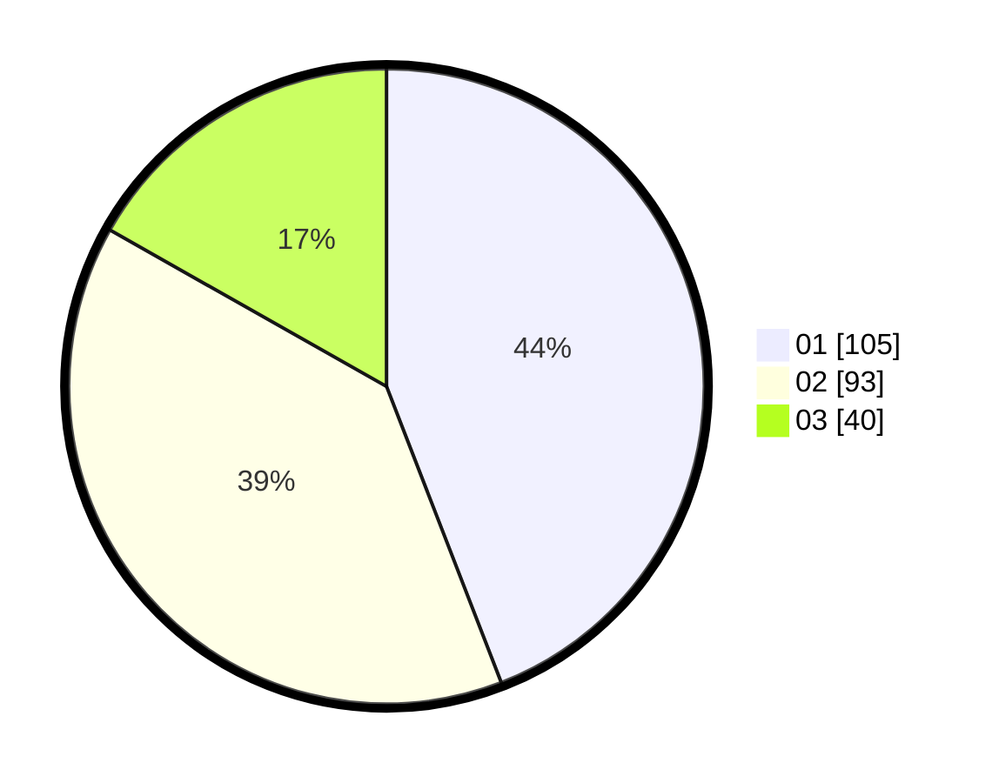

# Hasil

Hasil perolehan suara paslon dapat dilihat pada file paslon-01.txt, paslon-02.txt, dan paslon-03.txt.

Jika tidak ada, artinya data tersebut belum ada pada SIREKAP.

## Perolehan Suara

 * Paslon 01: **105**.
 * Paslon 02: **93**.
 * Paslon 03: **40**.

## Foto C Plano

https://sirekap-obj-formc.kpu.go.id/b8a3/pemilu/ppwp/31/75/01/10/02/3175011002094-20240216-153939--3de04699-020e-4d85-9e24-9545b7ce6bb0.jpg

https://sirekap-obj-formc.kpu.go.id/b8a3/pemilu/ppwp/31/75/01/10/02/3175011002094-20240216-153940--31e52348-4a3c-4c6f-b10a-aa78cb12aac0.jpg

https://sirekap-obj-formc.kpu.go.id/b8a3/pemilu/ppwp/31/75/01/10/02/3175011002094-20240214-194648--7660d101-24ac-4ee6-a03c-6d7a59ac3208.jpg

## DATA PEMILIH TETAP

Jumlah pemilih dalam DPT: **285**.
 * L: **137**.
 * P: **148**.

## DATA PENGGUNA HAK PILIH

Jumlah pengguna hak pilih dalam DPT: **242**.
 * L: **112**.
 * P: **130**.

Jumlah pengguna hak pilih dalam DPTb: **0**.
 * L: **0**.
 * P: **0**.

Jumlah pengguna hak pilih dalam DPK: **1**.
 * L: **1**.
 * P: **0**.

Jumlah pengguna hak pilih: **243**.
 * L: **113**.
 * P: **130**.

## JUMLAH SUARA SAH DAN TIDAK SAH

JUMLAH SELURUH SUARA SAH: **238**.

JUMLAH SUARA TIDAK SAH: **5**.

JUMLAH SELURUH SUARA SAH DAN SUARA TIDAK SAH: **243**.
