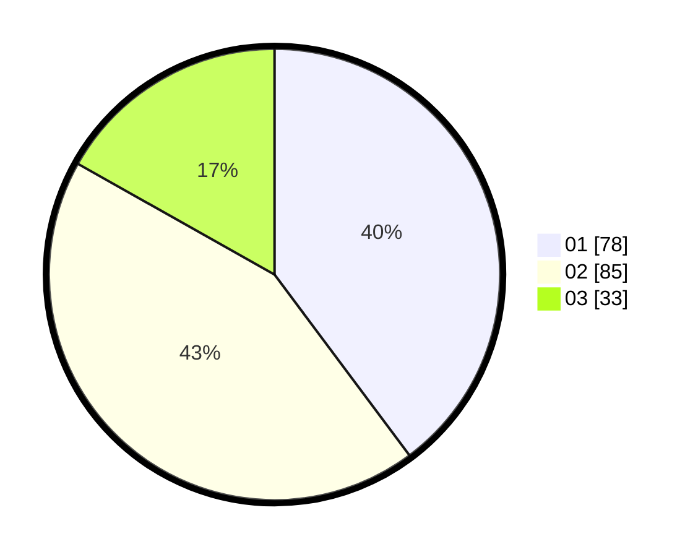

# Hasil

Hasil perolehan suara paslon dapat dilihat pada file paslon-01.txt, paslon-02.txt, dan paslon-03.txt.

Jika tidak ada, artinya data tersebut belum ada pada SIREKAP.

## Perolehan Suara

 * Paslon 01: **78**.
 * Paslon 02: **85**.
 * Paslon 03: **33**.

## Foto C Plano

https://sirekap-obj-formc.kpu.go.id/8913/pemilu/ppwp/31/75/01/10/03/3175011003001-20240214-222006--3c74e4c9-7534-4574-886e-5fc4acafb01b.jpg

https://sirekap-obj-formc.kpu.go.id/8913/pemilu/ppwp/31/75/01/10/03/3175011003001-20240214-223211--695b2f47-4537-4698-a665-43173ebfa837.jpg

https://sirekap-obj-formc.kpu.go.id/8913/pemilu/ppwp/31/75/01/10/03/3175011003001-20240214-224642--ac597c6e-b386-4679-9b1c-591bbea8253e.jpg

## DATA PEMILIH TETAP

Jumlah pemilih dalam DPT: **272**.
 * L: **128**.
 * P: **144**.

## DATA PENGGUNA HAK PILIH

Jumlah pengguna hak pilih dalam DPT: **196**.
 * L: **89**.
 * P: **107**.

Jumlah pengguna hak pilih dalam DPTb: **4**.
 * L: **1**.
 * P: **3**.

Jumlah pengguna hak pilih dalam DPK: **1**.
 * L: **1**.
 * P: **0**.

Jumlah pengguna hak pilih: **201**.
 * L: **91**.
 * P: **110**.

## JUMLAH SUARA SAH DAN TIDAK SAH

JUMLAH SELURUH SUARA SAH: **196**.

JUMLAH SUARA TIDAK SAH: **5**.

JUMLAH SELURUH SUARA SAH DAN SUARA TIDAK SAH: **201**.
