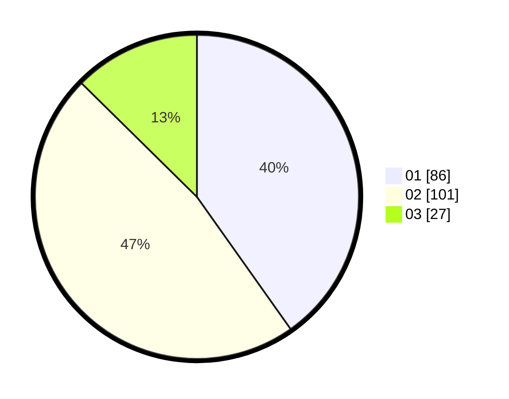

# Hasil

Hasil perolehan suara paslon dapat dilihat pada file paslon-01.txt, paslon-02.txt, dan paslon-03.txt.

Jika tidak ada, artinya data tersebut belum ada pada SIREKAP.

## Perolehan Suara

 * Paslon 01: **86**.
 * Paslon 02: **101**.
 * Paslon 03: **27**.

## Foto C Plano

https://sirekap-obj-formc.kpu.go.id/e5bd/pemilu/ppwp/31/75/01/10/03/3175011003004-20240214-204606--4735cb5a-27f3-4fb3-9747-514436cad947.jpg

https://sirekap-obj-formc.kpu.go.id/e5bd/pemilu/ppwp/31/75/01/10/03/3175011003004-20240214-204803--54fd8bcf-d705-4ec8-9d81-a4cededff5de.jpg

https://sirekap-obj-formc.kpu.go.id/e5bd/pemilu/ppwp/31/75/01/10/03/3175011003004-20240214-204901--758be9ec-3d1e-40ea-87cd-3c154e0e6212.jpg

## DATA PEMILIH TETAP

Jumlah pemilih dalam DPT: **270**.
 * L: **143**.
 * P: **127**.

## DATA PENGGUNA HAK PILIH

Jumlah pengguna hak pilih dalam DPT: **215**.
 * L: **110**.
 * P: **105**.

Jumlah pengguna hak pilih dalam DPTb: **0**.
 * L: **0**.
 * P: **0**.

Jumlah pengguna hak pilih dalam DPK: **2**.
 * L: **2**.
 * P: **0**.

Jumlah pengguna hak pilih: **217**.
 * L: **112**.
 * P: **105**.

## JUMLAH SUARA SAH DAN TIDAK SAH

JUMLAH SELURUH SUARA SAH: **214**.

JUMLAH SUARA TIDAK SAH: **3**.

JUMLAH SELURUH SUARA SAH DAN SUARA TIDAK SAH: **217**.
