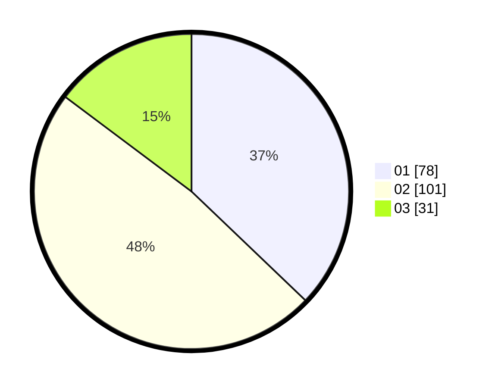

# Hasil

Hasil perolehan suara paslon dapat dilihat pada file paslon-01.txt, paslon-02.txt, dan paslon-03.txt.

Jika tidak ada, artinya data tersebut belum ada pada SIREKAP.

## Perolehan Suara

 * Paslon 01: **78**.
 * Paslon 02: **101**.
 * Paslon 03: **31**.

## Foto C Plano

https://sirekap-obj-formc.kpu.go.id/bf4a/pemilu/ppwp/31/75/01/10/03/3175011003006-20240215-010503--d2d171d4-ac3c-430f-aeac-7e9c20fde3a0.jpg

https://sirekap-obj-formc.kpu.go.id/bf4a/pemilu/ppwp/31/75/01/10/03/3175011003006-20240215-010827--53ea254b-9cf9-4d36-b0bf-38679d1c45d0.jpg

https://sirekap-obj-formc.kpu.go.id/bf4a/pemilu/ppwp/31/75/01/10/03/3175011003006-20240215-010943--ccc7eb7e-8c23-4e9d-b867-11e197048514.jpg
