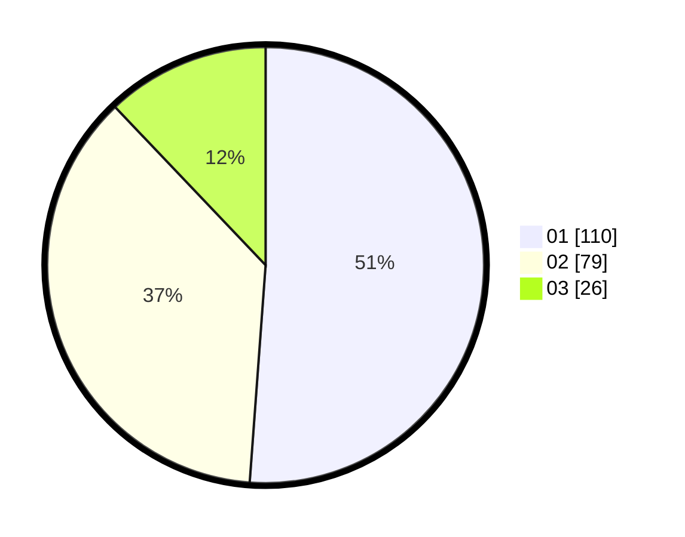

# Hasil

Hasil perolehan suara paslon dapat dilihat pada file paslon-01.txt, paslon-02.txt, dan paslon-03.txt.

Jika tidak ada, artinya data tersebut belum ada pada SIREKAP.

## Perolehan Suara

 * Paslon 01: **110**.
 * Paslon 02: **79**.
 * Paslon 03: **26**.

## Foto C Plano

https://sirekap-obj-formc.kpu.go.id/5229/pemilu/ppwp/31/75/01/10/03/3175011003007-20240214-204724--d738d801-6caf-445a-959b-a0eb2d868035.jpg

https://sirekap-obj-formc.kpu.go.id/5229/pemilu/ppwp/31/75/01/10/03/3175011003007-20240214-204743--7a037628-47f7-40b1-abb2-ad9c575276d8.jpg

https://sirekap-obj-formc.kpu.go.id/5229/pemilu/ppwp/31/75/01/10/03/3175011003007-20240214-204758--894bfeec-e23c-4995-b0bb-863635b609aa.jpg

## DATA PEMILIH TETAP

Jumlah pemilih dalam DPT: **264**.
 * L: **133**.
 * P: **131**.

## DATA PENGGUNA HAK PILIH

Jumlah pengguna hak pilih dalam DPT: **211**.
 * L: **104**.
 * P: **107**.

Jumlah pengguna hak pilih dalam DPTb: **2**.
 * L: **1**.
 * P: **1**.

Jumlah pengguna hak pilih dalam DPK: **4**.
 * L: **3**.
 * P: **1**.

Jumlah pengguna hak pilih: **217**.
 * L: **108**.
 * P: **109**.

## JUMLAH SUARA SAH DAN TIDAK SAH

JUMLAH SELURUH SUARA SAH: **215**.

JUMLAH SUARA TIDAK SAH: **2**.

JUMLAH SELURUH SUARA SAH DAN SUARA TIDAK SAH: **217**.
