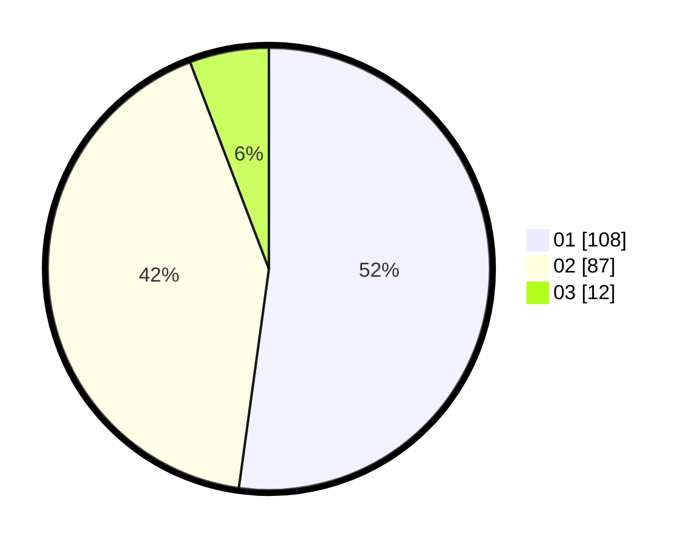

# Hasil

Hasil perolehan suara paslon dapat dilihat pada file paslon-01.txt, paslon-02.txt, dan paslon-03.txt.

Jika tidak ada, artinya data tersebut belum ada pada SIREKAP.

## Perolehan Suara

 * Paslon 01: **108**.
 * Paslon 02: **87**.
 * Paslon 03: **12**.

## Foto C Plano

https://sirekap-obj-formc.kpu.go.id/f8c4/pemilu/ppwp/31/75/01/10/03/3175011003008-20240214-200402--75fd627b-ddda-4bb6-9317-f38959427fc2.jpg

https://sirekap-obj-formc.kpu.go.id/f8c4/pemilu/ppwp/31/75/01/10/03/3175011003008-20240214-210342--5f334ae5-3df6-4a51-9af8-ad64a639f987.jpg

https://sirekap-obj-formc.kpu.go.id/f8c4/pemilu/ppwp/31/75/01/10/03/3175011003008-20240214-210553--132377e1-63bf-4184-bfbb-8269979e47d7.jpg
