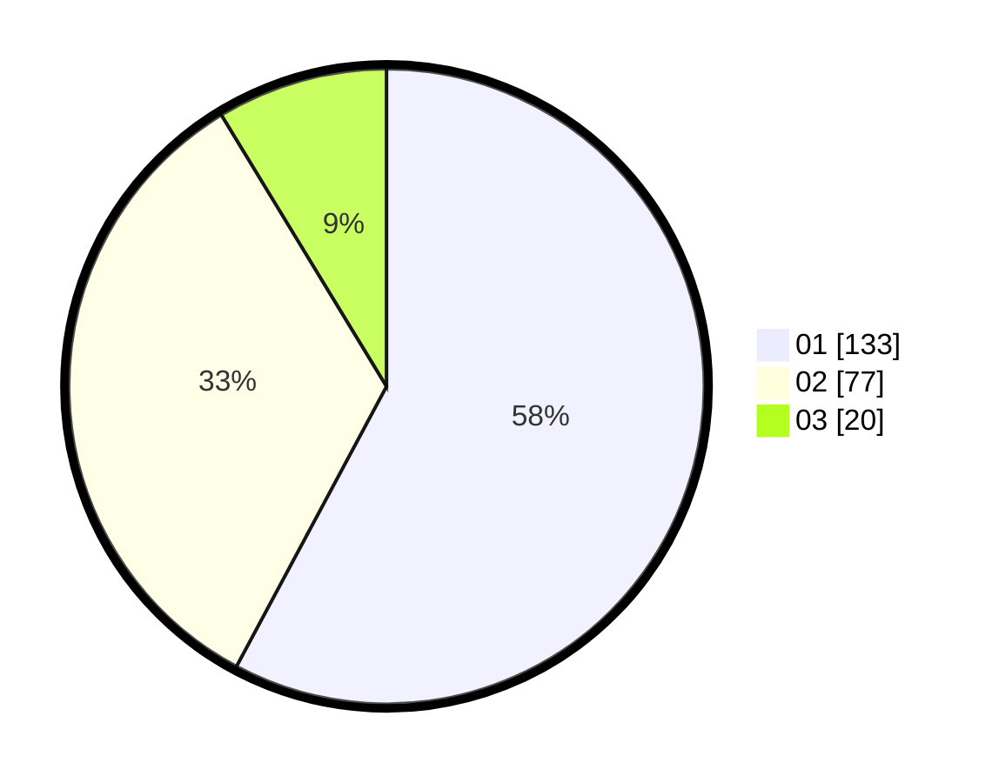

# Hasil

Hasil perolehan suara paslon dapat dilihat pada file paslon-01.txt, paslon-02.txt, dan paslon-03.txt.

Jika tidak ada, artinya data tersebut belum ada pada SIREKAP.

## Perolehan Suara

 * Paslon 01: **133**.
 * Paslon 02: **77**.
 * Paslon 03: **20**.

## Foto C Plano

https://sirekap-obj-formc.kpu.go.id/2955/pemilu/ppwp/31/75/01/10/03/3175011003012-20240214-201727--96e62d19-a6d9-429e-b049-56b85a038c0d.jpg

https://sirekap-obj-formc.kpu.go.id/2955/pemilu/ppwp/31/75/01/10/03/3175011003012-20240214-205042--bc8192c4-cfa4-4a6b-ad6e-94bd9a66dfb1.jpg

https://sirekap-obj-formc.kpu.go.id/2955/pemilu/ppwp/31/75/01/10/03/3175011003012-20240214-211406--25995fd4-3066-46f8-9814-cb5a1b98a3f1.jpg

## DATA PEMILIH TETAP

Jumlah pemilih dalam DPT: **273**.
 * L: **139**.
 * P: **134**.

## DATA PENGGUNA HAK PILIH

Jumlah pengguna hak pilih dalam DPT: **230**.
 * L: **113**.
 * P: **117**.

Jumlah pengguna hak pilih dalam DPTb: **1**.
 * L: **1**.
 * P: **0**.

Jumlah pengguna hak pilih dalam DPK: **1**.
 * L: **1**.
 * P: **0**.

Jumlah pengguna hak pilih: **232**.
 * L: **115**.
 * P: **117**.

## JUMLAH SUARA SAH DAN TIDAK SAH

JUMLAH SELURUH SUARA SAH: **230**.

JUMLAH SUARA TIDAK SAH: **2**.

JUMLAH SELURUH SUARA SAH DAN SUARA TIDAK SAH: **232**.
