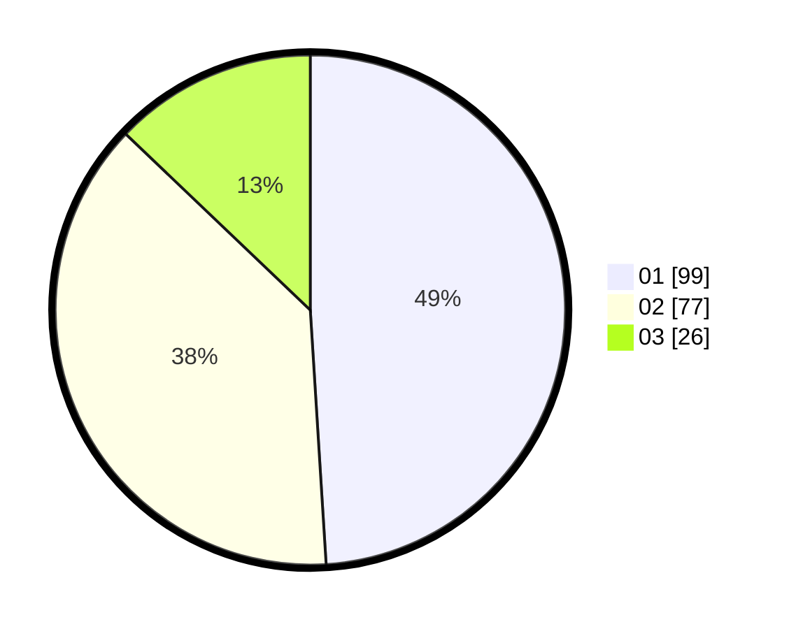

# Hasil

Hasil perolehan suara paslon dapat dilihat pada file paslon-01.txt, paslon-02.txt, dan paslon-03.txt.

Jika tidak ada, artinya data tersebut belum ada pada SIREKAP.

## Perolehan Suara

 * Paslon 01: **99**.
 * Paslon 02: **77**.
 * Paslon 03: **26**.

## Foto C Plano

https://sirekap-obj-formc.kpu.go.id/a762/pemilu/ppwp/31/75/01/10/03/3175011003013-20240214-233650--ac9afd24-1562-462b-96ef-f3316bb0bb12.jpg

https://sirekap-obj-formc.kpu.go.id/a762/pemilu/ppwp/31/75/01/10/03/3175011003013-20240214-233804--3586697d-21d5-4103-93dd-d63e8f0606d3.jpg

https://sirekap-obj-formc.kpu.go.id/a762/pemilu/ppwp/31/75/01/10/03/3175011003013-20240214-230757--f3060053-fcdf-49f8-af33-3528beb4a08b.jpg

## DATA PEMILIH TETAP

Jumlah pemilih dalam DPT: **258**.
 * L: **128**.
 * P: **130**.

## DATA PENGGUNA HAK PILIH

Jumlah pengguna hak pilih dalam DPT: **200**.
 * L: **92**.
 * P: **108**.

Jumlah pengguna hak pilih dalam DPTb: **0**.
 * L: **0**.
 * P: **0**.

Jumlah pengguna hak pilih dalam DPK: **3**.
 * L: **2**.
 * P: **1**.

Jumlah pengguna hak pilih: **203**.
 * L: **94**.
 * P: **109**.

## JUMLAH SUARA SAH DAN TIDAK SAH

JUMLAH SELURUH SUARA SAH: **202**.

JUMLAH SUARA TIDAK SAH: **1**.

JUMLAH SELURUH SUARA SAH DAN SUARA TIDAK SAH: **203**.
