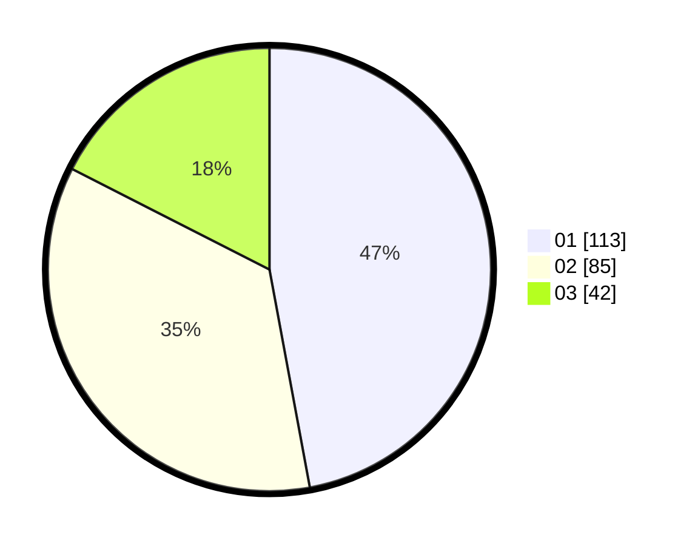

# Hasil

Hasil perolehan suara paslon dapat dilihat pada file paslon-01.txt, paslon-02.txt, dan paslon-03.txt.

Jika tidak ada, artinya data tersebut belum ada pada SIREKAP.

## Perolehan Suara

 * Paslon 01: **113**.
 * Paslon 02: **85**.
 * Paslon 03: **42**.

## Foto C Plano

https://sirekap-obj-formc.kpu.go.id/808a/pemilu/ppwp/31/75/01/10/03/3175011003014-20240215-020831--cd49ee91-fdce-47f8-a6b2-f6316de1547c.jpg

https://sirekap-obj-formc.kpu.go.id/808a/pemilu/ppwp/31/75/01/10/03/3175011003014-20240215-020722--152e5134-853a-4dfa-b81a-805343a6491e.jpg

https://sirekap-obj-formc.kpu.go.id/808a/pemilu/ppwp/31/75/01/10/03/3175011003014-20240215-022604--35a1d1ee-a3a5-49c9-b330-472e890ea2ba.jpg
