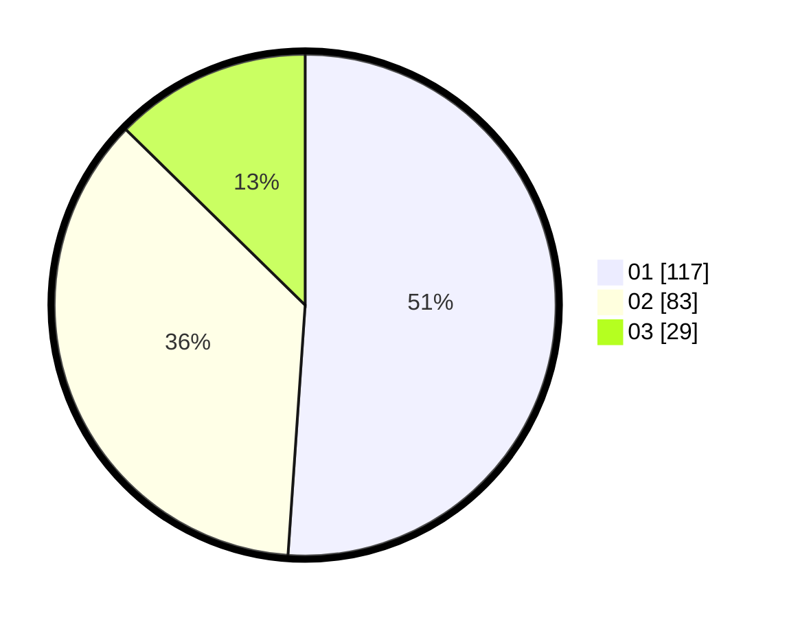

# Hasil

Hasil perolehan suara paslon dapat dilihat pada file paslon-01.txt, paslon-02.txt, dan paslon-03.txt.

Jika tidak ada, artinya data tersebut belum ada pada SIREKAP.

## Perolehan Suara

 * Paslon 01: **117**.
 * Paslon 02: **83**.
 * Paslon 03: **29**.

## Foto C Plano

https://sirekap-obj-formc.kpu.go.id/f52d/pemilu/ppwp/31/75/01/10/03/3175011003017-20240214-224447--773322f9-55c2-4bae-82f6-641ee12355d9.jpg

https://sirekap-obj-formc.kpu.go.id/f52d/pemilu/ppwp/31/75/01/10/03/3175011003017-20240214-203540--8de676bf-7caf-4421-b2f3-1cf5f1783308.jpg

https://sirekap-obj-formc.kpu.go.id/f52d/pemilu/ppwp/31/75/01/10/03/3175011003017-20240214-203650--966ec986-a72c-4e3b-8e8c-9bd18ec9084a.jpg

## DATA PEMILIH TETAP

Jumlah pemilih dalam DPT: **272**.
 * L: **122**.
 * P: **150**.

## DATA PENGGUNA HAK PILIH

Jumlah pengguna hak pilih dalam DPT: **229**.
 * L: **109**.
 * P: **120**.

Jumlah pengguna hak pilih dalam DPTb: **1**.
 * L: **1**.
 * P: **0**.

Jumlah pengguna hak pilih dalam DPK: **0**.
 * L: **0**.
 * P: **0**.

Jumlah pengguna hak pilih: **230**.
 * L: **110**.
 * P: **120**.

## JUMLAH SUARA SAH DAN TIDAK SAH

JUMLAH SELURUH SUARA SAH: **229**.

JUMLAH SUARA TIDAK SAH: **1**.

JUMLAH SELURUH SUARA SAH DAN SUARA TIDAK SAH: **230**.
