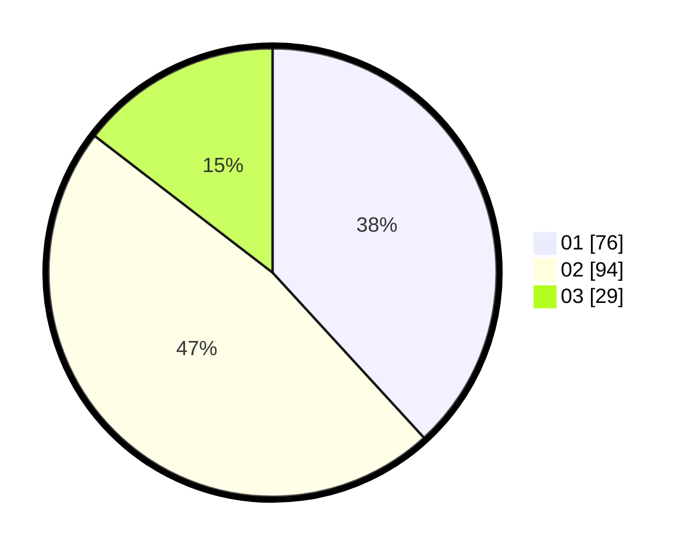

# Hasil

Hasil perolehan suara paslon dapat dilihat pada file paslon-01.txt, paslon-02.txt, dan paslon-03.txt.

Jika tidak ada, artinya data tersebut belum ada pada SIREKAP.

## Perolehan Suara

 * Paslon 01: **76**.
 * Paslon 02: **94**.
 * Paslon 03: **29**.

## Foto C Plano

https://sirekap-obj-formc.kpu.go.id/f6dc/pemilu/ppwp/31/75/01/10/03/3175011003018-20240214-202234--0a646fc1-8e8d-48ab-9522-5fd6bcfc3847.jpg

https://sirekap-obj-formc.kpu.go.id/f6dc/pemilu/ppwp/31/75/01/10/03/3175011003018-20240214-202322--ce02ba3b-1626-4f99-a334-411df8986eae.jpg

https://sirekap-obj-formc.kpu.go.id/f6dc/pemilu/ppwp/31/75/01/10/03/3175011003018-20240214-202359--cd48aba5-fcd5-40b2-a92a-19b394d1be38.jpg

## DATA PEMILIH TETAP

Jumlah pemilih dalam DPT: **265**.
 * L: **135**.
 * P: **130**.

## DATA PENGGUNA HAK PILIH

Jumlah pengguna hak pilih dalam DPT: **197**.
 * L: **96**.
 * P: **101**.

Jumlah pengguna hak pilih dalam DPTb: **0**.
 * L: **0**.
 * P: **0**.

Jumlah pengguna hak pilih dalam DPK: **8**.
 * L: **4**.
 * P: **4**.

Jumlah pengguna hak pilih: **205**.
 * L: **100**.
 * P: **105**.

## JUMLAH SUARA SAH DAN TIDAK SAH

JUMLAH SELURUH SUARA SAH: **199**.

JUMLAH SUARA TIDAK SAH: **6**.

JUMLAH SELURUH SUARA SAH DAN SUARA TIDAK SAH: **205**.
