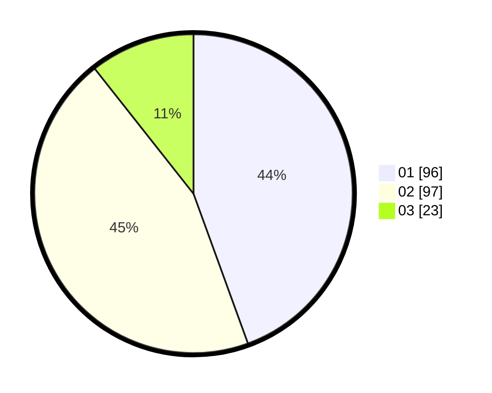

# Hasil

Hasil perolehan suara paslon dapat dilihat pada file paslon-01.txt, paslon-02.txt, dan paslon-03.txt.

Jika tidak ada, artinya data tersebut belum ada pada SIREKAP.

## Perolehan Suara

 * Paslon 01: **96**.
 * Paslon 02: **97**.
 * Paslon 03: **23**.

## Foto C Plano

https://sirekap-obj-formc.kpu.go.id/6dc7/pemilu/ppwp/31/75/01/10/03/3175011003019-20240214-193304--0f6d3392-7c38-46cc-aafa-3f9e166430bf.jpg

https://sirekap-obj-formc.kpu.go.id/6dc7/pemilu/ppwp/31/75/01/10/03/3175011003019-20240214-193555--2ade13d3-449b-4e54-a878-866a8179f2a7.jpg

https://sirekap-obj-formc.kpu.go.id/6dc7/pemilu/ppwp/31/75/01/10/03/3175011003019-20240214-193914--7b6fd1dc-8de2-4664-be71-ed289e587961.jpg

## DATA PEMILIH TETAP

Jumlah pemilih dalam DPT: **265**.
 * L: **120**.
 * P: **145**.

## DATA PENGGUNA HAK PILIH

Jumlah pengguna hak pilih dalam DPT: **206**.
 * L: **93**.
 * P: **113**.

Jumlah pengguna hak pilih dalam DPTb: **3**.
 * L: **1**.
 * P: **2**.

Jumlah pengguna hak pilih dalam DPK: **7**.
 * L: **0**.
 * P: **7**.

Jumlah pengguna hak pilih: **216**.
 * L: **94**.
 * P: **122**.

## JUMLAH SUARA SAH DAN TIDAK SAH

JUMLAH SELURUH SUARA SAH: **216**.

JUMLAH SUARA TIDAK SAH: **0**.

JUMLAH SELURUH SUARA SAH DAN SUARA TIDAK SAH: **216**.
