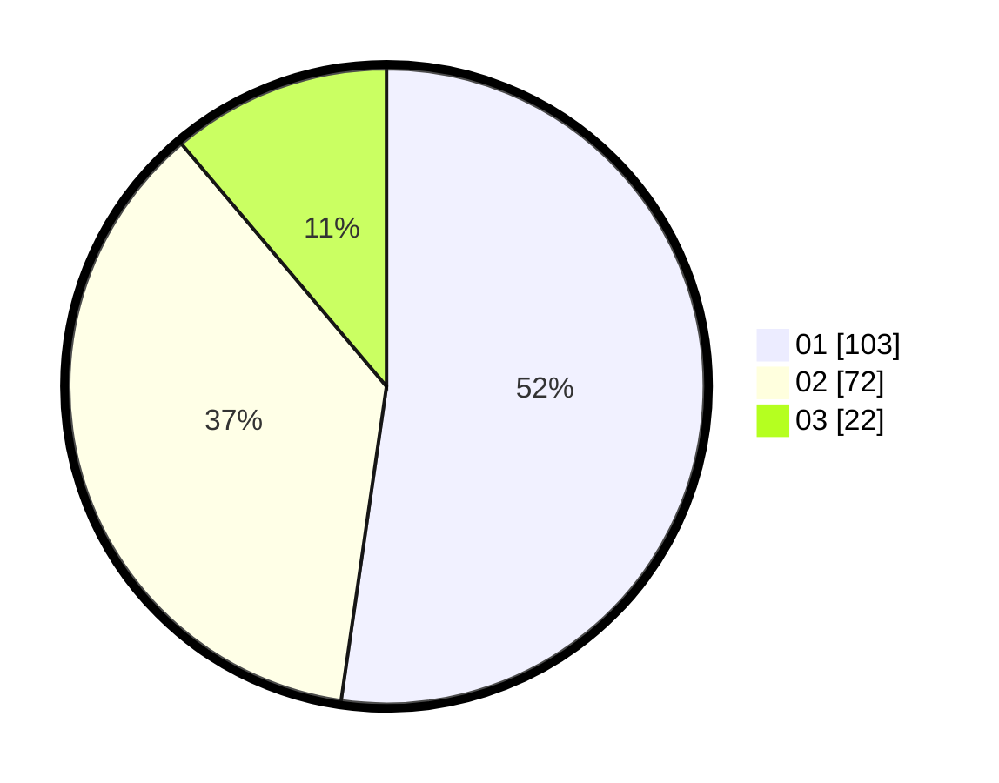

# Hasil

Hasil perolehan suara paslon dapat dilihat pada file paslon-01.txt, paslon-02.txt, dan paslon-03.txt.

Jika tidak ada, artinya data tersebut belum ada pada SIREKAP.

## Perolehan Suara

 * Paslon 01: **103**.
 * Paslon 02: **72**.
 * Paslon 03: **22**.

## Foto C Plano

https://sirekap-obj-formc.kpu.go.id/2f62/pemilu/ppwp/31/75/01/10/03/3175011003021-20240215-004316--3f2a646f-4c19-4989-845b-df0a79b4e717.jpg

https://sirekap-obj-formc.kpu.go.id/2f62/pemilu/ppwp/31/75/01/10/03/3175011003021-20240215-004506--dcac15e7-f623-4544-91e7-c83b155fc367.jpg

https://sirekap-obj-formc.kpu.go.id/2f62/pemilu/ppwp/31/75/01/10/03/3175011003021-20240215-005223--09d32a25-f895-47e1-b94b-6d81c4d141b7.jpg
