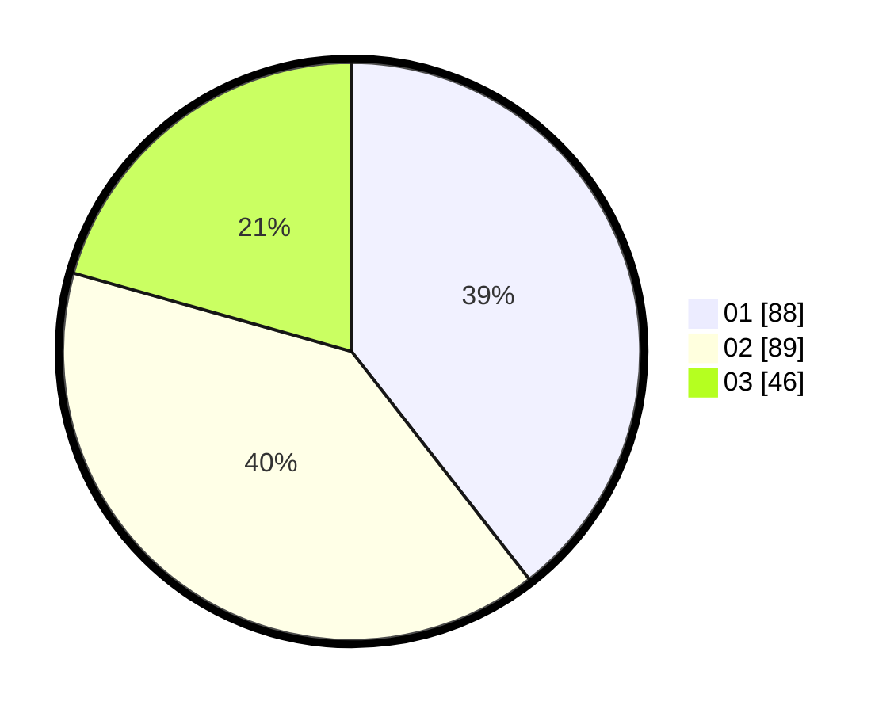

# Hasil

Hasil perolehan suara paslon dapat dilihat pada file paslon-01.txt, paslon-02.txt, dan paslon-03.txt.

Jika tidak ada, artinya data tersebut belum ada pada SIREKAP.

## Perolehan Suara

 * Paslon 01: **88**.
 * Paslon 02: **89**.
 * Paslon 03: **46**.

## Foto C Plano

https://sirekap-obj-formc.kpu.go.id/c12e/pemilu/ppwp/31/75/01/10/03/3175011003022-20240214-211254--c3cd0b5b-3f8e-4fe0-800c-4bfaa2cb5af7.jpg

https://sirekap-obj-formc.kpu.go.id/c12e/pemilu/ppwp/31/75/01/10/03/3175011003022-20240214-211357--7ac57b41-401f-4902-ba56-c6cf108b0e81.jpg

https://sirekap-obj-formc.kpu.go.id/c12e/pemilu/ppwp/31/75/01/10/03/3175011003022-20240214-211504--a6b2e4cc-8701-4e67-9110-774d0899f765.jpg
