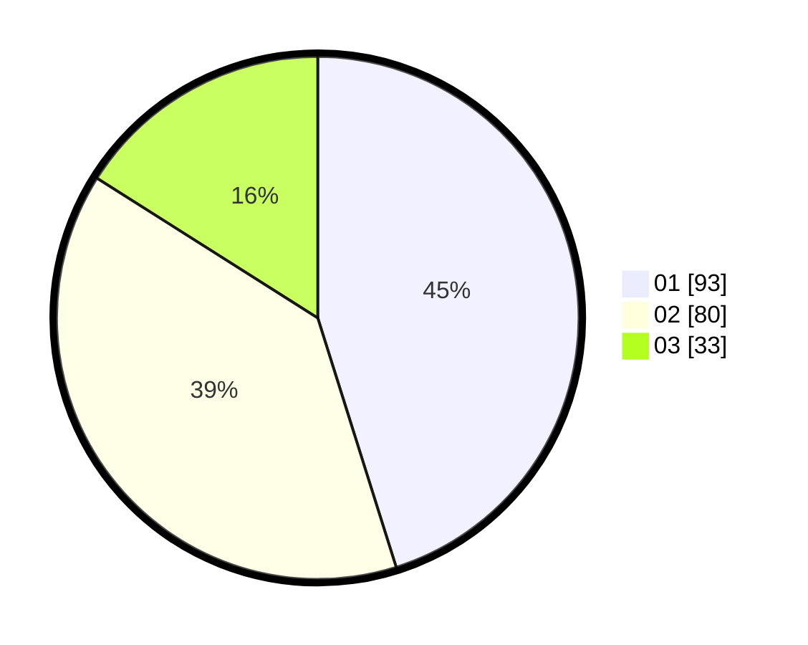

# Hasil

Hasil perolehan suara paslon dapat dilihat pada file paslon-01.txt, paslon-02.txt, dan paslon-03.txt.

Jika tidak ada, artinya data tersebut belum ada pada SIREKAP.

## Perolehan Suara

 * Paslon 01: **93**.
 * Paslon 02: **80**.
 * Paslon 03: **33**.

## Foto C Plano

https://sirekap-obj-formc.kpu.go.id/ae2d/pemilu/ppwp/31/75/01/10/03/3175011003030-20240214-190441--8c7a50af-6957-49fa-ace4-5d7162cccdaf.jpg

https://sirekap-obj-formc.kpu.go.id/ae2d/pemilu/ppwp/31/75/01/10/03/3175011003030-20240214-190455--ebe7cae4-255a-4824-b882-ec5013fe5202.jpg

https://sirekap-obj-formc.kpu.go.id/ae2d/pemilu/ppwp/31/75/01/10/03/3175011003030-20240214-190508--c4facb9e-46f0-43dd-a8fb-117e713dc919.jpg

## DATA PEMILIH TETAP

Jumlah pemilih dalam DPT: **258**.
 * L: **116**.
 * P: **142**.

## DATA PENGGUNA HAK PILIH

Jumlah pengguna hak pilih dalam DPT: **204**.
 * L: **87**.
 * P: **117**.

Jumlah pengguna hak pilih dalam DPTb: **4**.
 * L: **2**.
 * P: **2**.

Jumlah pengguna hak pilih dalam DPK: **3**.
 * L: **1**.
 * P: **2**.

Jumlah pengguna hak pilih: **211**.
 * L: **90**.
 * P: **121**.

## JUMLAH SUARA SAH DAN TIDAK SAH

JUMLAH SELURUH SUARA SAH: **206**.

JUMLAH SUARA TIDAK SAH: **5**.

JUMLAH SELURUH SUARA SAH DAN SUARA TIDAK SAH: **211**.
