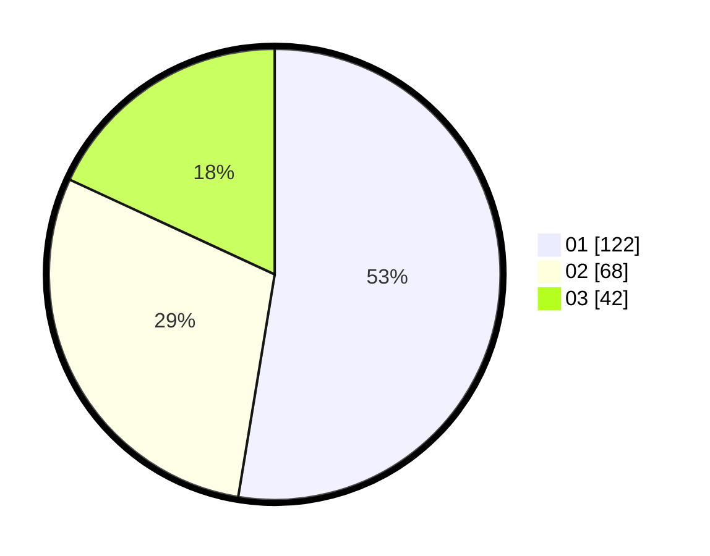

# Hasil

Hasil perolehan suara paslon dapat dilihat pada file paslon-01.txt, paslon-02.txt, dan paslon-03.txt.

Jika tidak ada, artinya data tersebut belum ada pada SIREKAP.

## Perolehan Suara

 * Paslon 01: **122**.
 * Paslon 02: **68**.
 * Paslon 03: **42**.

## Foto C Plano

https://sirekap-obj-formc.kpu.go.id/9077/pemilu/ppwp/31/75/01/10/03/3175011003031-20240214-185711--13f22170-9457-4f04-92b5-11a923c2d4fb.jpg

https://sirekap-obj-formc.kpu.go.id/9077/pemilu/ppwp/31/75/01/10/03/3175011003031-20240214-185728--59845f84-d341-4524-8f40-0f450021e47e.jpg

https://sirekap-obj-formc.kpu.go.id/9077/pemilu/ppwp/31/75/01/10/03/3175011003031-20240214-185742--ced3aee2-7975-4b84-b603-37e02ef675e4.jpg

## DATA PEMILIH TETAP

Jumlah pemilih dalam DPT: **282**.
 * L: **123**.
 * P: **159**.

## DATA PENGGUNA HAK PILIH

Jumlah pengguna hak pilih dalam DPT: **228**.
 * L: **98**.
 * P: **130**.

Jumlah pengguna hak pilih dalam DPTb: **2**.
 * L: **1**.
 * P: **1**.

Jumlah pengguna hak pilih dalam DPK: **5**.
 * L: **2**.
 * P: **3**.

Jumlah pengguna hak pilih: **235**.
 * L: **101**.
 * P: **134**.

## JUMLAH SUARA SAH DAN TIDAK SAH

JUMLAH SELURUH SUARA SAH: **232**.

JUMLAH SUARA TIDAK SAH: **3**.

JUMLAH SELURUH SUARA SAH DAN SUARA TIDAK SAH: **235**.
