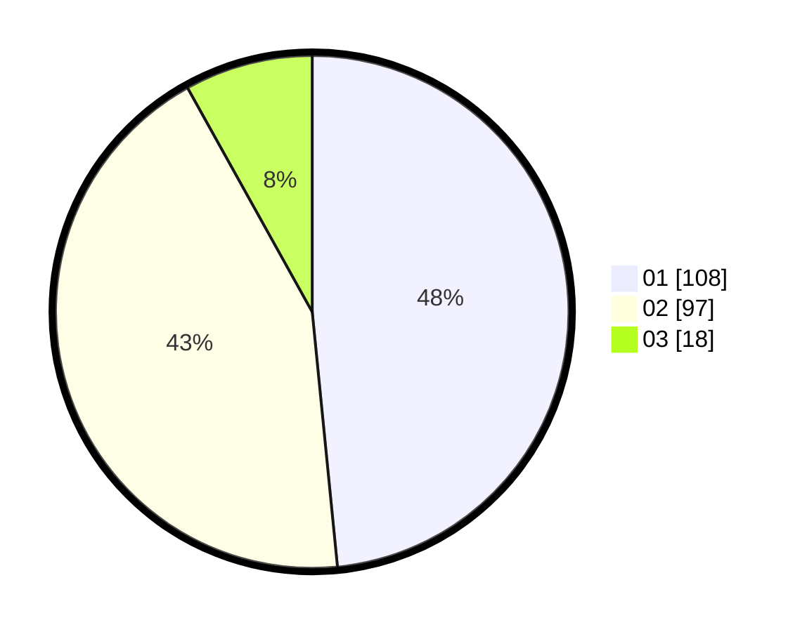

# Hasil

Hasil perolehan suara paslon dapat dilihat pada file paslon-01.txt, paslon-02.txt, dan paslon-03.txt.

Jika tidak ada, artinya data tersebut belum ada pada SIREKAP.

## Perolehan Suara

 * Paslon 01: **108**.
 * Paslon 02: **97**.
 * Paslon 03: **18**.

## Foto C Plano

https://sirekap-obj-formc.kpu.go.id/97b9/pemilu/ppwp/31/75/01/10/03/3175011003033-20240214-203300--1b28d3a6-34e8-4991-982e-876e3dde5b55.jpg

https://sirekap-obj-formc.kpu.go.id/97b9/pemilu/ppwp/31/75/01/10/03/3175011003033-20240214-203650--ed363a67-467a-44f5-a508-40d0e2f8c5fc.jpg
