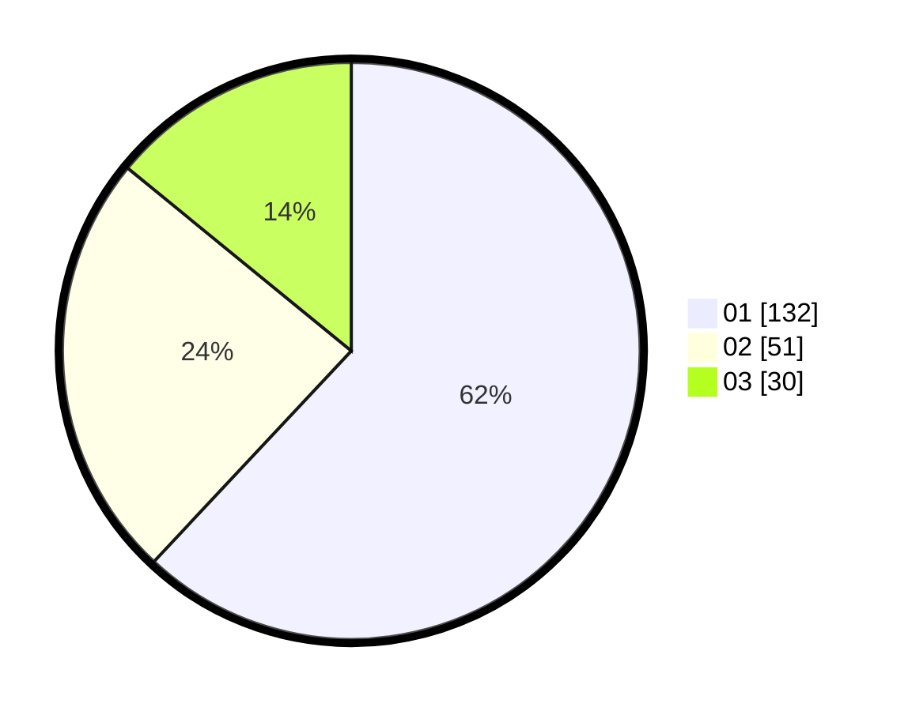

# Hasil

Hasil perolehan suara paslon dapat dilihat pada file paslon-01.txt, paslon-02.txt, dan paslon-03.txt.

Jika tidak ada, artinya data tersebut belum ada pada SIREKAP.

## Perolehan Suara

 * Paslon 01: **132**.
 * Paslon 02: **51**.
 * Paslon 03: **30**.

## Foto C Plano

https://sirekap-obj-formc.kpu.go.id/dbc6/pemilu/ppwp/31/75/01/10/03/3175011003035-20240214-203918--364b3873-2d03-49d6-8e2e-e720f4a091ca.jpg

https://sirekap-obj-formc.kpu.go.id/dbc6/pemilu/ppwp/31/75/01/10/03/3175011003035-20240214-204146--35a453dc-b1f2-43b0-b368-80b358e0f7ef.jpg

https://sirekap-obj-formc.kpu.go.id/dbc6/pemilu/ppwp/31/75/01/10/03/3175011003035-20240214-204447--258a6e57-86e6-4d4b-b1c5-c308f33126da.jpg

## DATA PEMILIH TETAP

Jumlah pemilih dalam DPT: **283**.
 * L: **140**.
 * P: **143**.

## DATA PENGGUNA HAK PILIH

Jumlah pengguna hak pilih dalam DPT: **216**.
 * L: **104**.
 * P: **112**.

Jumlah pengguna hak pilih dalam DPTb: **0**.
 * L: **0**.
 * P: **0**.

Jumlah pengguna hak pilih dalam DPK: **0**.
 * L: **0**.
 * P: **0**.

Jumlah pengguna hak pilih: **216**.
 * L: **104**.
 * P: **112**.

## JUMLAH SUARA SAH DAN TIDAK SAH

JUMLAH SELURUH SUARA SAH: **213**.

JUMLAH SUARA TIDAK SAH: **3**.

JUMLAH SELURUH SUARA SAH DAN SUARA TIDAK SAH: **216**.
