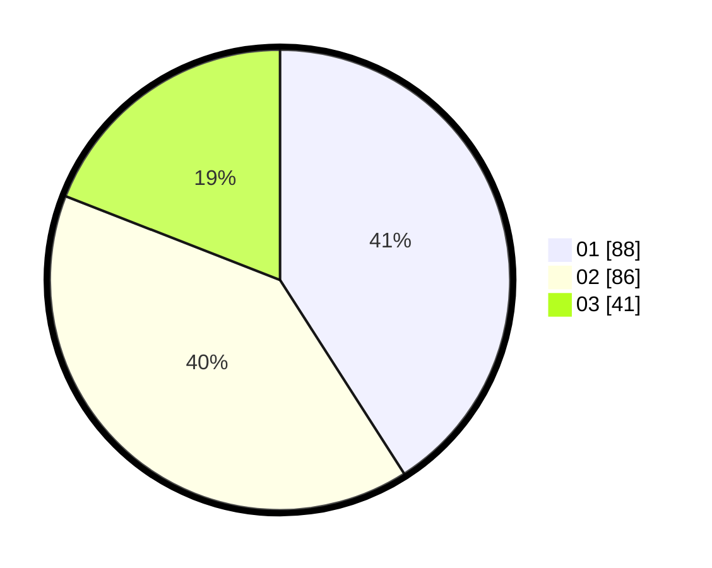

# Hasil

Hasil perolehan suara paslon dapat dilihat pada file paslon-01.txt, paslon-02.txt, dan paslon-03.txt.

Jika tidak ada, artinya data tersebut belum ada pada SIREKAP.

## Perolehan Suara

 * Paslon 01: **88**.
 * Paslon 02: **86**.
 * Paslon 03: **41**.

## Foto C Plano

https://sirekap-obj-formc.kpu.go.id/5685/pemilu/ppwp/31/75/01/10/03/3175011003036-20240214-221523--491a6a1b-5a89-48d5-adde-fca6b6ffe098.jpg

https://sirekap-obj-formc.kpu.go.id/5685/pemilu/ppwp/31/75/01/10/03/3175011003036-20240214-215705--2c044b80-14e8-4981-8734-2cb53c00d62e.jpg

https://sirekap-obj-formc.kpu.go.id/5685/pemilu/ppwp/31/75/01/10/03/3175011003036-20240214-215828--498e3ab8-f735-4f90-8577-78559c6bb6fe.jpg
