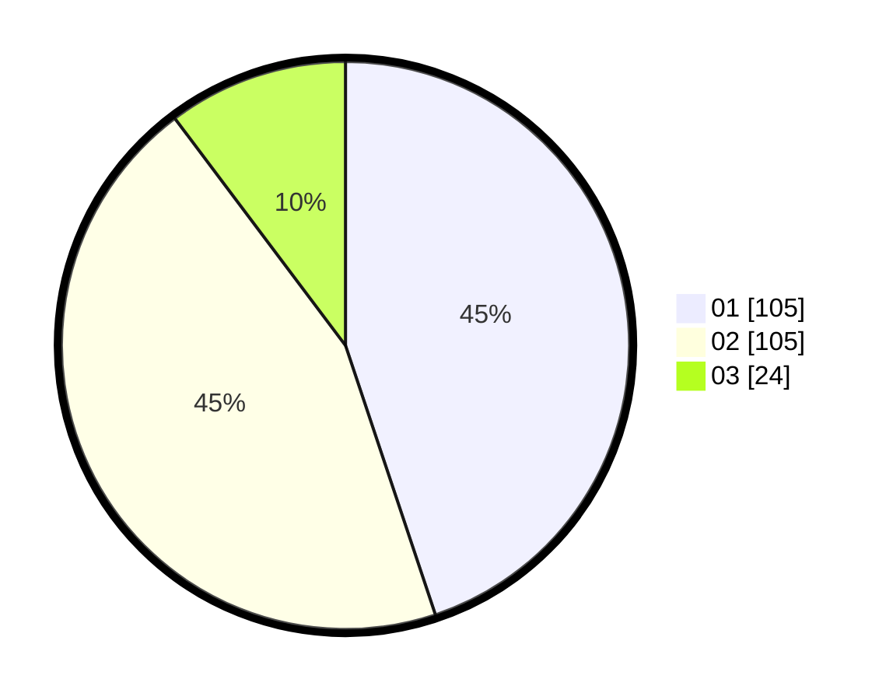

# Hasil

Hasil perolehan suara paslon dapat dilihat pada file paslon-01.txt, paslon-02.txt, dan paslon-03.txt.

Jika tidak ada, artinya data tersebut belum ada pada SIREKAP.

## Perolehan Suara

 * Paslon 01: **105**.
 * Paslon 02: **105**.
 * Paslon 03: **24**.

## Foto C Plano

https://sirekap-obj-formc.kpu.go.id/8d5a/pemilu/ppwp/31/75/01/10/03/3175011003041-20240214-190009--ae3e0a27-878d-404d-ae58-824f8b1788da.jpg

https://sirekap-obj-formc.kpu.go.id/8d5a/pemilu/ppwp/31/75/01/10/03/3175011003041-20240214-160100--3d7cdde1-5636-4094-8600-bb1a489363f6.jpg

https://sirekap-obj-formc.kpu.go.id/8d5a/pemilu/ppwp/31/75/01/10/03/3175011003041-20240214-190148--49ede40a-4232-43d1-a3d5-80616f7af779.jpg

## DATA PEMILIH TETAP

Jumlah pemilih dalam DPT: **284**.
 * L: **127**.
 * P: **157**.

## DATA PENGGUNA HAK PILIH

Jumlah pengguna hak pilih dalam DPT: **229**.
 * L: **101**.
 * P: **128**.

Jumlah pengguna hak pilih dalam DPTb: **6**.
 * L: **4**.
 * P: **2**.

Jumlah pengguna hak pilih dalam DPK: **1**.
 * L: **0**.
 * P: **1**.

Jumlah pengguna hak pilih: **236**.
 * L: **105**.
 * P: **131**.

## JUMLAH SUARA SAH DAN TIDAK SAH

JUMLAH SELURUH SUARA SAH: **234**.

JUMLAH SUARA TIDAK SAH: **2**.

JUMLAH SELURUH SUARA SAH DAN SUARA TIDAK SAH: **236**.
