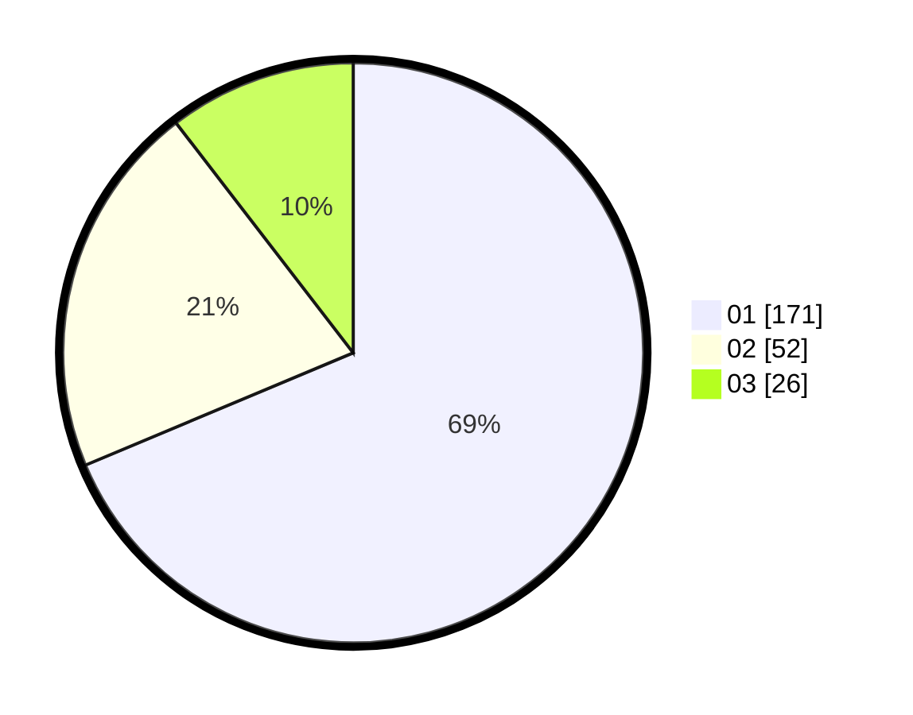

# Hasil

Hasil perolehan suara paslon dapat dilihat pada file paslon-01.txt, paslon-02.txt, dan paslon-03.txt.

Jika tidak ada, artinya data tersebut belum ada pada SIREKAP.

## Perolehan Suara

 * Paslon 01: **171**.
 * Paslon 02: **52**.
 * Paslon 03: **26**.

## Foto C Plano

https://sirekap-obj-formc.kpu.go.id/a073/pemilu/ppwp/31/75/01/10/03/3175011003046-20240214-215901--44919773-6a05-4c70-94c6-7d27d212dc67.jpg

https://sirekap-obj-formc.kpu.go.id/a073/pemilu/ppwp/31/75/01/10/03/3175011003046-20240214-230433--a64fa616-9f58-42c3-996e-403b49a971e4.jpg

https://sirekap-obj-formc.kpu.go.id/a073/pemilu/ppwp/31/75/01/10/03/3175011003046-20240214-230559--5c8523e5-b12b-480d-baeb-40cf797c20b6.jpg
