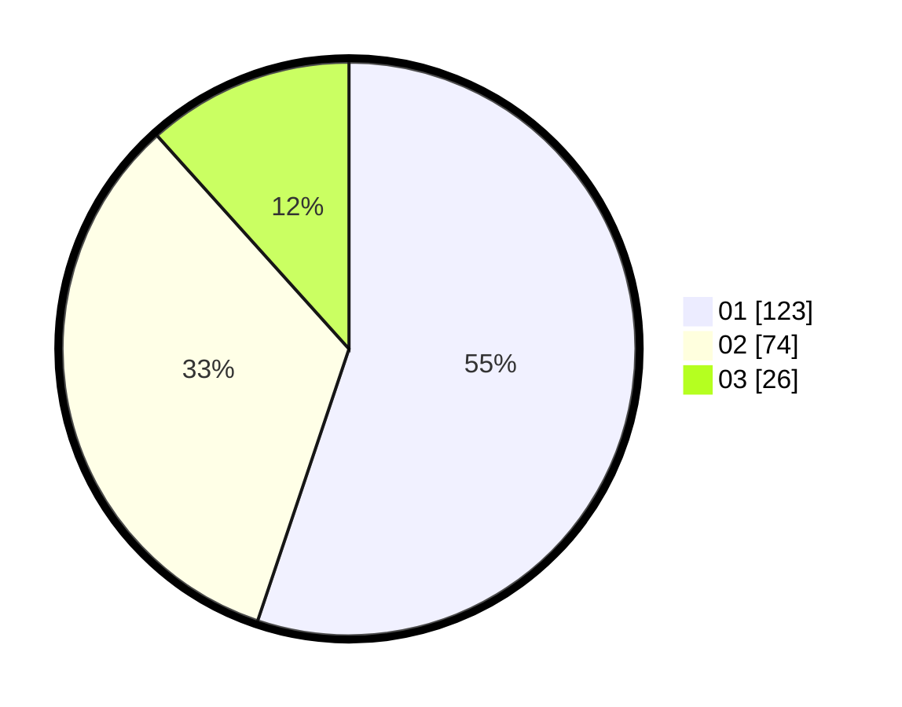

# Hasil

Hasil perolehan suara paslon dapat dilihat pada file paslon-01.txt, paslon-02.txt, dan paslon-03.txt.

Jika tidak ada, artinya data tersebut belum ada pada SIREKAP.

## Perolehan Suara

 * Paslon 01: **123**.
 * Paslon 02: **74**.
 * Paslon 03: **26**.

## Foto C Plano

https://sirekap-obj-formc.kpu.go.id/82b6/pemilu/ppwp/31/75/01/10/03/3175011003048-20240215-002934--7f5dbd6c-53f8-4e4a-aeae-51c3dd524410.jpg

https://sirekap-obj-formc.kpu.go.id/82b6/pemilu/ppwp/31/75/01/10/03/3175011003048-20240215-003120--9409eb2b-76b5-4b10-9d47-15adf0e39bc7.jpg

https://sirekap-obj-formc.kpu.go.id/82b6/pemilu/ppwp/31/75/01/10/03/3175011003048-20240215-003225--c9a59168-e63f-4148-afba-6c920119a619.jpg
