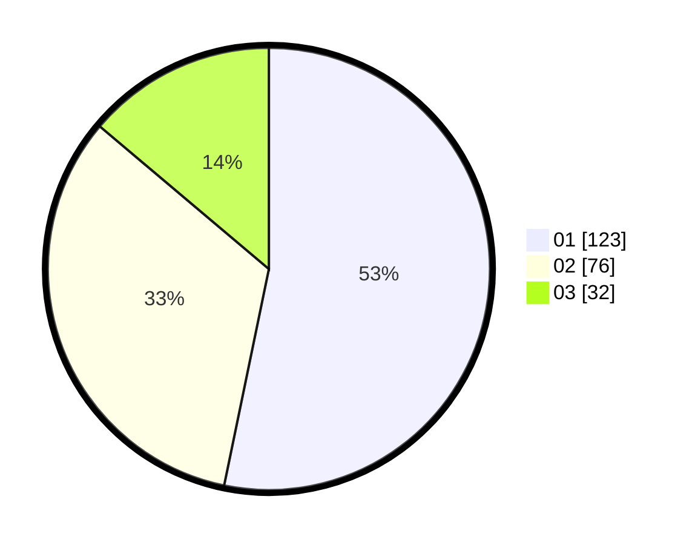

# Hasil

Hasil perolehan suara paslon dapat dilihat pada file paslon-01.txt, paslon-02.txt, dan paslon-03.txt.

Jika tidak ada, artinya data tersebut belum ada pada SIREKAP.

## Perolehan Suara

 * Paslon 01: **123**.
 * Paslon 02: **76**.
 * Paslon 03: **32**.

## Foto C Plano

https://sirekap-obj-formc.kpu.go.id/bc7e/pemilu/ppwp/31/75/01/10/03/3175011003051-20240214-194743--7978e0bb-980c-4ab4-8c20-c0c266d10a95.jpg

https://sirekap-obj-formc.kpu.go.id/bc7e/pemilu/ppwp/31/75/01/10/03/3175011003051-20240214-192617--6bb10309-9aa2-45f9-9308-66b2da230091.jpg

https://sirekap-obj-formc.kpu.go.id/bc7e/pemilu/ppwp/31/75/01/10/03/3175011003051-20240214-193909--d3c1b543-1bad-4548-95e4-3cc46fe31216.jpg

## DATA PEMILIH TETAP

Jumlah pemilih dalam DPT: **282**.
 * L: **142**.
 * P: **140**.

## DATA PENGGUNA HAK PILIH

Jumlah pengguna hak pilih dalam DPT: **228**.
 * L: **110**.
 * P: **118**.

Jumlah pengguna hak pilih dalam DPTb: **2**.
 * L: **2**.
 * P: **0**.

Jumlah pengguna hak pilih dalam DPK: **2**.
 * L: **0**.
 * P: **2**.

Jumlah pengguna hak pilih: **232**.
 * L: **112**.
 * P: **120**.

## JUMLAH SUARA SAH DAN TIDAK SAH

JUMLAH SELURUH SUARA SAH: **231**.

JUMLAH SUARA TIDAK SAH: **1**.

JUMLAH SELURUH SUARA SAH DAN SUARA TIDAK SAH: **232**.
