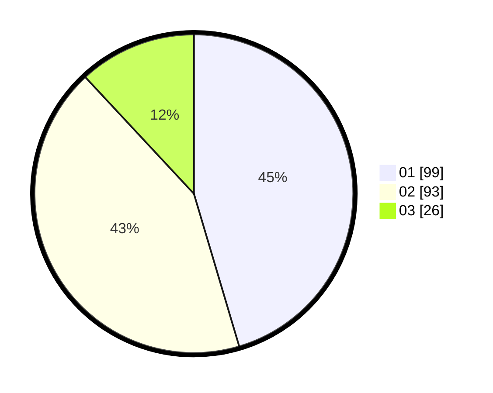

# Hasil

Hasil perolehan suara paslon dapat dilihat pada file paslon-01.txt, paslon-02.txt, dan paslon-03.txt.

Jika tidak ada, artinya data tersebut belum ada pada SIREKAP.

## Perolehan Suara

 * Paslon 01: **99**.
 * Paslon 02: **93**.
 * Paslon 03: **26**.

## Foto C Plano

https://sirekap-obj-formc.kpu.go.id/638b/pemilu/ppwp/31/75/01/10/03/3175011003052-20240214-184521--b71acba4-f780-4360-9902-513088573ce2.jpg

https://sirekap-obj-formc.kpu.go.id/638b/pemilu/ppwp/31/75/01/10/03/3175011003052-20240214-184934--c5985e6d-0a39-40dc-a068-7ddfb6571812.jpg

https://sirekap-obj-formc.kpu.go.id/638b/pemilu/ppwp/31/75/01/10/03/3175011003052-20240214-185233--94f68abc-154c-4add-a77e-de6f2b96f1a5.jpg

## DATA PEMILIH TETAP

Jumlah pemilih dalam DPT: **292**.
 * L: **145**.
 * P: **147**.

## DATA PENGGUNA HAK PILIH

Jumlah pengguna hak pilih dalam DPT: **220**.
 * L: **97**.
 * P: **123**.

Jumlah pengguna hak pilih dalam DPTb: **2**.
 * L: **2**.
 * P: **0**.

Jumlah pengguna hak pilih dalam DPK: **0**.
 * L: **0**.
 * P: **0**.

Jumlah pengguna hak pilih: **222**.
 * L: **99**.
 * P: **123**.

## JUMLAH SUARA SAH DAN TIDAK SAH

JUMLAH SELURUH SUARA SAH: **218**.

JUMLAH SUARA TIDAK SAH: **4**.

JUMLAH SELURUH SUARA SAH DAN SUARA TIDAK SAH: **222**.
