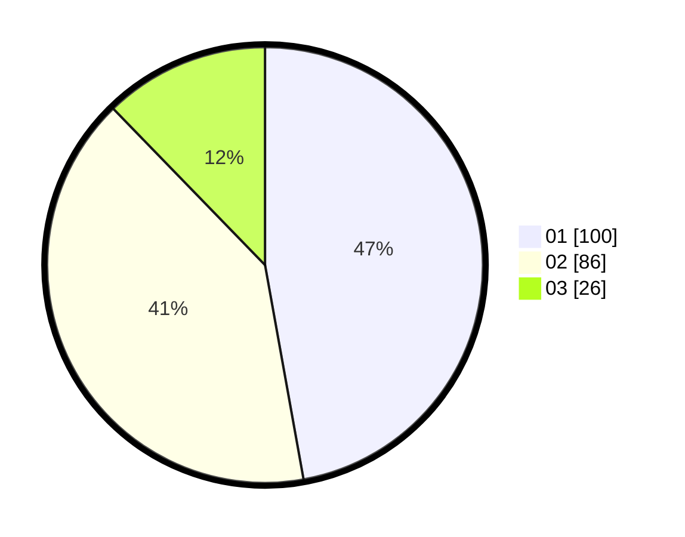

# Hasil

Hasil perolehan suara paslon dapat dilihat pada file paslon-01.txt, paslon-02.txt, dan paslon-03.txt.

Jika tidak ada, artinya data tersebut belum ada pada SIREKAP.

## Perolehan Suara

 * Paslon 01: **100**.
 * Paslon 02: **86**.
 * Paslon 03: **26**.

## Foto C Plano

https://sirekap-obj-formc.kpu.go.id/2583/pemilu/ppwp/31/75/01/10/03/3175011003056-20240214-212939--000d41fd-3221-4ecd-ae4c-027de03dab10.jpg

https://sirekap-obj-formc.kpu.go.id/2583/pemilu/ppwp/31/75/01/10/03/3175011003056-20240214-224216--8703d46e-f93c-4cde-af76-2b645ad4b413.jpg

https://sirekap-obj-formc.kpu.go.id/2583/pemilu/ppwp/31/75/01/10/03/3175011003056-20240214-223959--ad1d41d0-e4e3-4e6e-94f8-d9bb7cd68652.jpg
