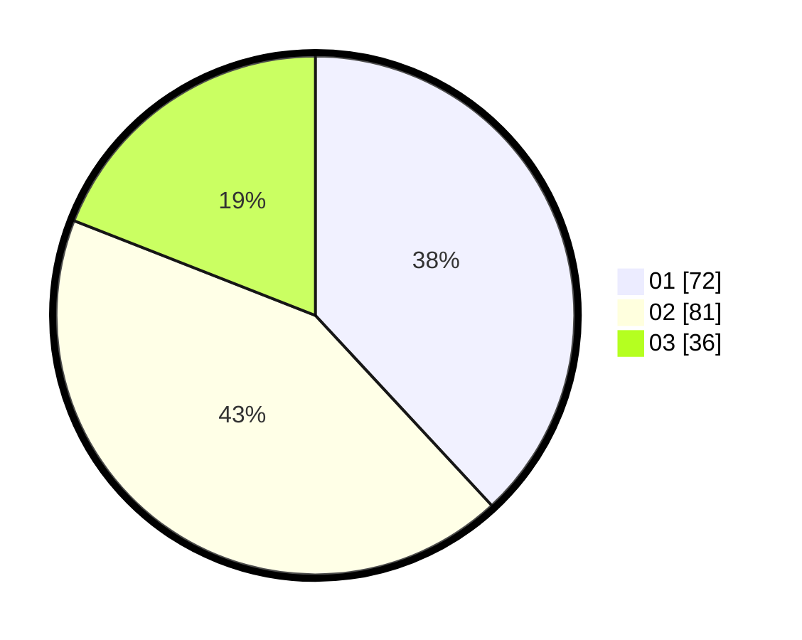

# Hasil

Hasil perolehan suara paslon dapat dilihat pada file paslon-01.txt, paslon-02.txt, dan paslon-03.txt.

Jika tidak ada, artinya data tersebut belum ada pada SIREKAP.

## Perolehan Suara

 * Paslon 01: **72**.
 * Paslon 02: **81**.
 * Paslon 03: **36**.

## Foto C Plano

https://sirekap-obj-formc.kpu.go.id/66f2/pemilu/ppwp/31/75/01/10/03/3175011003057-20240214-220851--9961d53a-2f5a-4361-bedd-30453297602c.jpg

https://sirekap-obj-formc.kpu.go.id/66f2/pemilu/ppwp/31/75/01/10/03/3175011003057-20240214-221125--afcc2c48-13b0-4247-81d7-07ab74cb7693.jpg

https://sirekap-obj-formc.kpu.go.id/66f2/pemilu/ppwp/31/75/01/10/03/3175011003057-20240214-221314--94201756-d539-4d62-8865-483d01c082a2.jpg
