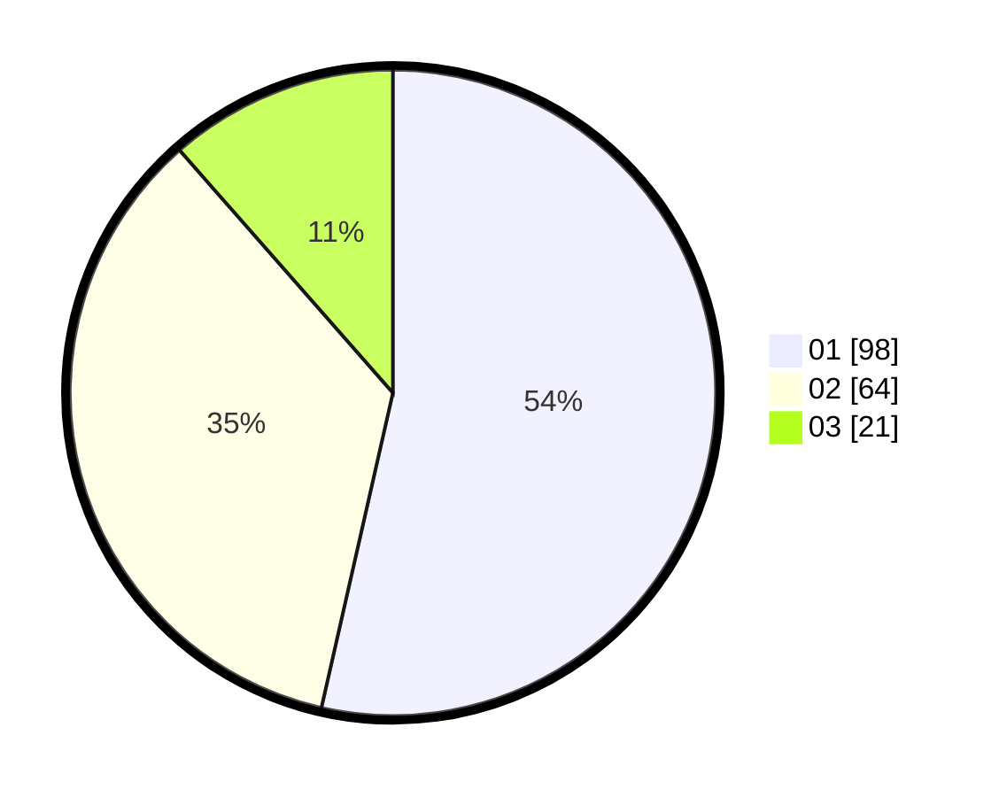

# Hasil

Hasil perolehan suara paslon dapat dilihat pada file paslon-01.txt, paslon-02.txt, dan paslon-03.txt.

Jika tidak ada, artinya data tersebut belum ada pada SIREKAP.

## Perolehan Suara

 * Paslon 01: **98**.
 * Paslon 02: **64**.
 * Paslon 03: **21**.

## Foto C Plano

https://sirekap-obj-formc.kpu.go.id/3a69/pemilu/ppwp/31/75/01/10/03/3175011003058-20240214-200547--64ff92ad-0d05-482e-a027-e1e7d5d63768.jpg

https://sirekap-obj-formc.kpu.go.id/3a69/pemilu/ppwp/31/75/01/10/03/3175011003058-20240214-200312--1af24c54-1439-4d54-aea5-9fd122a0e779.jpg

https://sirekap-obj-formc.kpu.go.id/3a69/pemilu/ppwp/31/75/01/10/03/3175011003058-20240214-200430--325dcd24-cc3b-4db0-a924-25b3614e6236.jpg
