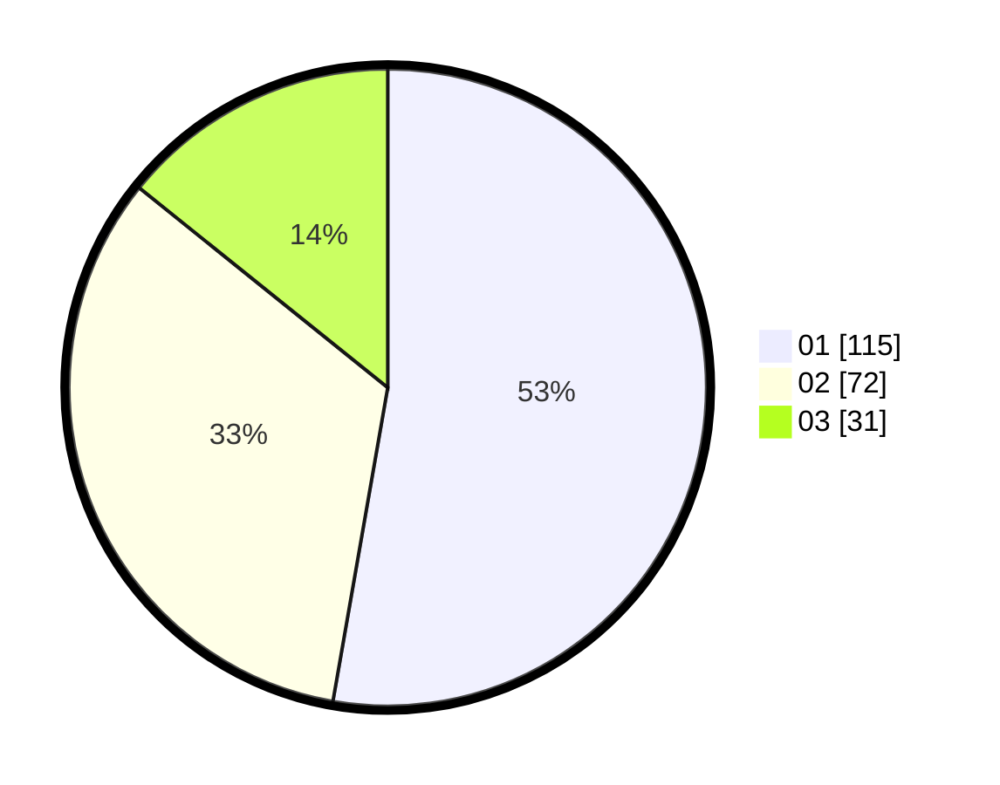

# Hasil

Hasil perolehan suara paslon dapat dilihat pada file paslon-01.txt, paslon-02.txt, dan paslon-03.txt.

Jika tidak ada, artinya data tersebut belum ada pada SIREKAP.

## Perolehan Suara

 * Paslon 01: **115**.
 * Paslon 02: **72**.
 * Paslon 03: **31**.

## Foto C Plano

https://sirekap-obj-formc.kpu.go.id/f22c/pemilu/ppwp/31/75/01/10/03/3175011003063-20240214-211741--9a329b36-1e90-4489-a2d9-5845a45de3f0.jpg

https://sirekap-obj-formc.kpu.go.id/f22c/pemilu/ppwp/31/75/01/10/03/3175011003063-20240214-212104--ea6a6d3f-6bc7-425e-8583-8444414abd19.jpg

https://sirekap-obj-formc.kpu.go.id/f22c/pemilu/ppwp/31/75/01/10/03/3175011003063-20240214-212334--f65fc83e-d47e-43ef-8593-7e5c5605e506.jpg

## DATA PEMILIH TETAP

Jumlah pemilih dalam DPT: **269**.
 * L: **132**.
 * P: **137**.

## DATA PENGGUNA HAK PILIH

Jumlah pengguna hak pilih dalam DPT: **214**.
 * L: **103**.
 * P: **111**.

Jumlah pengguna hak pilih dalam DPTb: **7**.
 * L: **3**.
 * P: **4**.

Jumlah pengguna hak pilih dalam DPK: **0**.
 * L: **0**.
 * P: **0**.

Jumlah pengguna hak pilih: **221**.
 * L: **106**.
 * P: **115**.

## JUMLAH SUARA SAH DAN TIDAK SAH

JUMLAH SELURUH SUARA SAH: **218**.

JUMLAH SUARA TIDAK SAH: **3**.

JUMLAH SELURUH SUARA SAH DAN SUARA TIDAK SAH: **221**.
