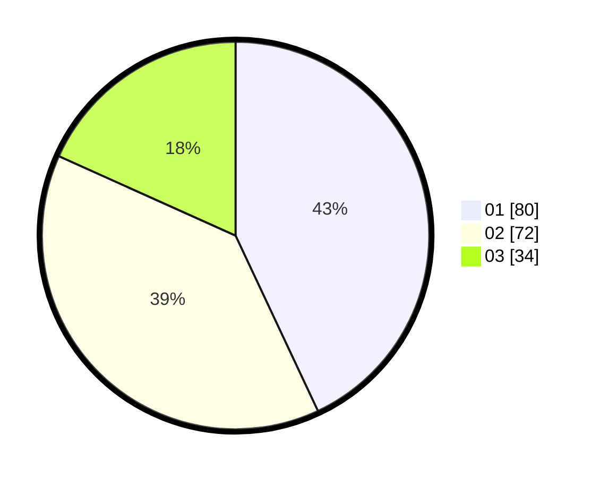

# Hasil

Hasil perolehan suara paslon dapat dilihat pada file paslon-01.txt, paslon-02.txt, dan paslon-03.txt.

Jika tidak ada, artinya data tersebut belum ada pada SIREKAP.

## Perolehan Suara

 * Paslon 01: **80**.
 * Paslon 02: **72**.
 * Paslon 03: **34**.

## Foto C Plano

https://sirekap-obj-formc.kpu.go.id/15a7/pemilu/ppwp/31/75/01/10/03/3175011003064-20240214-203154--db4031a8-a78c-46f3-bf8c-e7e7a60f83c1.jpg

https://sirekap-obj-formc.kpu.go.id/15a7/pemilu/ppwp/31/75/01/10/03/3175011003064-20240214-203700--3e634c43-67aa-4f53-af03-819285d32ffa.jpg

https://sirekap-obj-formc.kpu.go.id/15a7/pemilu/ppwp/31/75/01/10/03/3175011003064-20240214-203838--7b53168a-99d9-476b-b093-27212d2a97ef.jpg
