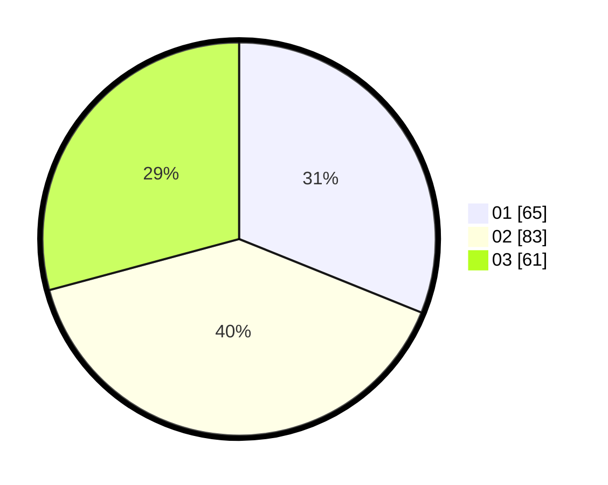

# Hasil

Hasil perolehan suara paslon dapat dilihat pada file paslon-01.txt, paslon-02.txt, dan paslon-03.txt.

Jika tidak ada, artinya data tersebut belum ada pada SIREKAP.

## Perolehan Suara

 * Paslon 01: **65**.
 * Paslon 02: **83**.
 * Paslon 03: **61**.

## Foto C Plano

https://sirekap-obj-formc.kpu.go.id/85b2/pemilu/ppwp/31/75/01/10/03/3175011003065-20240214-231620--51749d07-48b1-4f68-b2dd-c21b08112a73.jpg

https://sirekap-obj-formc.kpu.go.id/85b2/pemilu/ppwp/31/75/01/10/03/3175011003065-20240214-231734--1e069a6b-6929-4c16-9f27-a4fc510685ea.jpg

https://sirekap-obj-formc.kpu.go.id/85b2/pemilu/ppwp/31/75/01/10/03/3175011003065-20240214-231824--9a5d6219-88e1-4ad8-a3fe-640b4bbc8ef2.jpg
