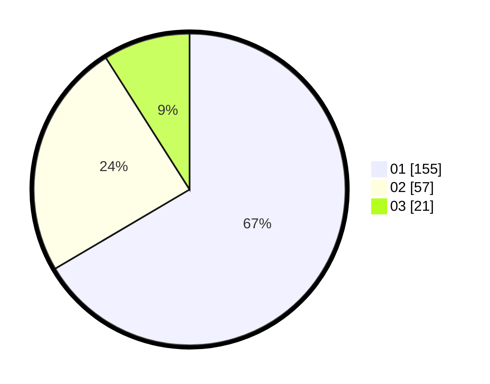

# Hasil

Hasil perolehan suara paslon dapat dilihat pada file paslon-01.txt, paslon-02.txt, dan paslon-03.txt.

Jika tidak ada, artinya data tersebut belum ada pada SIREKAP.

## Perolehan Suara

 * Paslon 01: **155**.
 * Paslon 02: **57**.
 * Paslon 03: **21**.

## Foto C Plano

https://sirekap-obj-formc.kpu.go.id/d462/pemilu/ppwp/31/75/01/10/03/3175011003072-20240215-212554--0aa57e2f-2f9e-4c3c-afc0-779bb9d03bd4.jpg

https://sirekap-obj-formc.kpu.go.id/d462/pemilu/ppwp/31/75/01/10/03/3175011003072-20240214-191520--d01be70a-3c47-4e8f-a880-421fbbd45a6b.jpg

https://sirekap-obj-formc.kpu.go.id/d462/pemilu/ppwp/31/75/01/10/03/3175011003072-20240214-191726--ea507198-225d-4053-a4fa-c0318e66bd8e.jpg

## DATA PEMILIH TETAP

Jumlah pemilih dalam DPT: **281**.
 * L: **132**.
 * P: **149**.

## DATA PENGGUNA HAK PILIH

Jumlah pengguna hak pilih dalam DPT: **233**.
 * L: **111**.
 * P: **122**.

Jumlah pengguna hak pilih dalam DPTb: **1**.
 * L: **0**.
 * P: **1**.

Jumlah pengguna hak pilih dalam DPK: **0**.
 * L: **0**.
 * P: **0**.

Jumlah pengguna hak pilih: **234**.
 * L: **111**.
 * P: **123**.

## JUMLAH SUARA SAH DAN TIDAK SAH

JUMLAH SELURUH SUARA SAH: **233**.

JUMLAH SUARA TIDAK SAH: **1**.

JUMLAH SELURUH SUARA SAH DAN SUARA TIDAK SAH: **234**.
