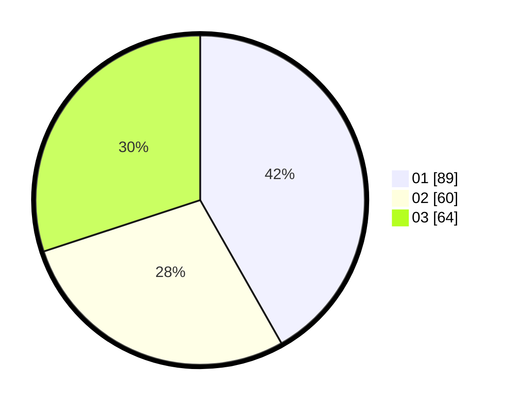

# Hasil

Hasil perolehan suara paslon dapat dilihat pada file paslon-01.txt, paslon-02.txt, dan paslon-03.txt.

Jika tidak ada, artinya data tersebut belum ada pada SIREKAP.

## Perolehan Suara

 * Paslon 01: **89**.
 * Paslon 02: **60**.
 * Paslon 03: **64**.

## Foto C Plano

https://sirekap-obj-formc.kpu.go.id/69c8/pemilu/ppwp/31/75/01/10/03/3175011003077-20240214-155254--9d7daca3-7245-422a-87e6-0e46289443d9.jpg

https://sirekap-obj-formc.kpu.go.id/69c8/pemilu/ppwp/31/75/01/10/03/3175011003077-20240214-155740--6de9d8be-6dde-49dc-8fb0-4ec7956239ec.jpg
