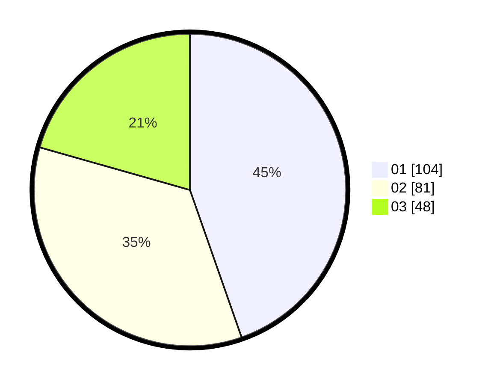

# Hasil

Hasil perolehan suara paslon dapat dilihat pada file paslon-01.txt, paslon-02.txt, dan paslon-03.txt.

Jika tidak ada, artinya data tersebut belum ada pada SIREKAP.

## Perolehan Suara

 * Paslon 01: **104**.
 * Paslon 02: **81**.
 * Paslon 03: **48**.

## Foto C Plano

https://sirekap-obj-formc.kpu.go.id/9cd2/pemilu/ppwp/31/75/01/10/03/3175011003082-20240215-232228--1d71aa5a-2541-4d28-a667-566c3c61aec4.jpg

https://sirekap-obj-formc.kpu.go.id/9cd2/pemilu/ppwp/31/75/01/10/03/3175011003082-20240216-010840--280b3160-61ba-40c0-8e54-a961c5813439.jpg

https://sirekap-obj-formc.kpu.go.id/9cd2/pemilu/ppwp/31/75/01/10/03/3175011003082-20240216-003834--4eee02c1-2ebf-42af-869c-53e58f063b4b.jpg

## DATA PEMILIH TETAP

Jumlah pemilih dalam DPT: **292**.
 * L: **131**.
 * P: **161**.

## DATA PENGGUNA HAK PILIH

Jumlah pengguna hak pilih dalam DPT: **235**.
 * L: **101**.
 * P: **134**.

Jumlah pengguna hak pilih dalam DPTb: **1**.
 * L: **0**.
 * P: **1**.

Jumlah pengguna hak pilih dalam DPK: **0**.
 * L: **0**.
 * P: **0**.

Jumlah pengguna hak pilih: **236**.
 * L: **101**.
 * P: **135**.

## JUMLAH SUARA SAH DAN TIDAK SAH

JUMLAH SELURUH SUARA SAH: **235**.

JUMLAH SUARA TIDAK SAH: **3**.

JUMLAH SELURUH SUARA SAH DAN SUARA TIDAK SAH: **238**.
