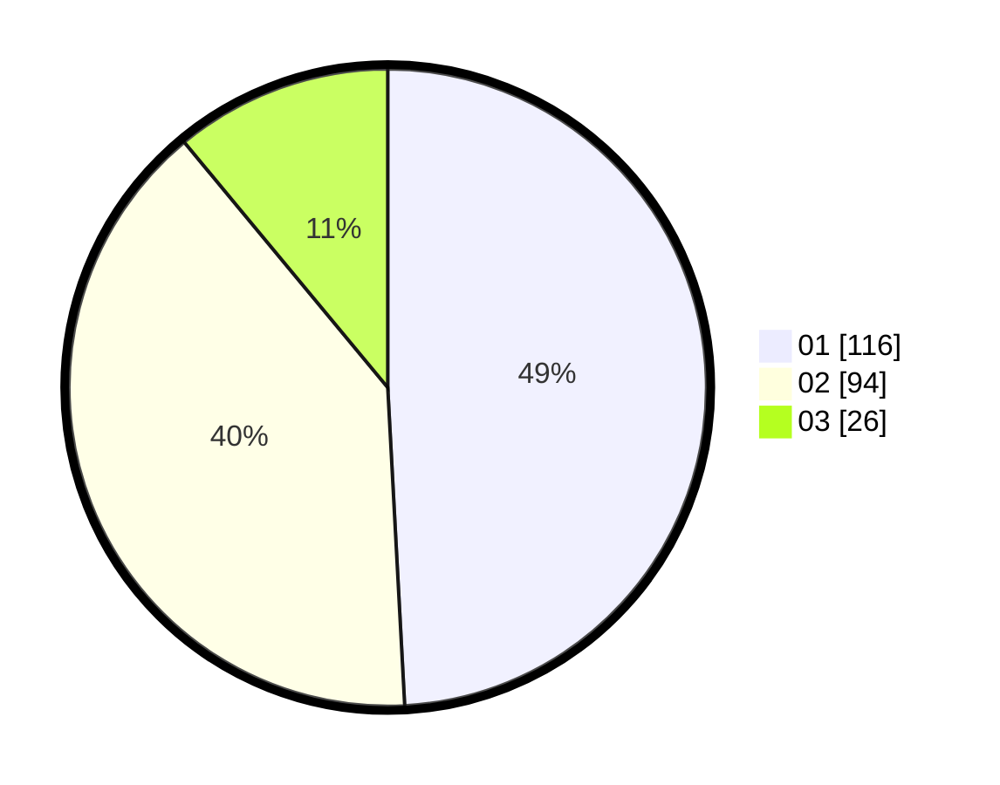

# Hasil

Hasil perolehan suara paslon dapat dilihat pada file paslon-01.txt, paslon-02.txt, dan paslon-03.txt.

Jika tidak ada, artinya data tersebut belum ada pada SIREKAP.

## Perolehan Suara

 * Paslon 01: **116**.
 * Paslon 02: **94**.
 * Paslon 03: **26**.

## Foto C Plano

https://sirekap-obj-formc.kpu.go.id/9aea/pemilu/ppwp/31/75/01/10/03/3175011003084-20240214-234725--852017b9-7fac-474f-85bf-8e45e1f95d7c.jpg

https://sirekap-obj-formc.kpu.go.id/9aea/pemilu/ppwp/31/75/01/10/03/3175011003084-20240214-234816--9fefa560-cff7-4746-a30e-3af50bc45ae0.jpg

https://sirekap-obj-formc.kpu.go.id/9aea/pemilu/ppwp/31/75/01/10/03/3175011003084-20240214-235009--fe3d5c3a-b69a-403b-a89c-25ba219d4559.jpg
