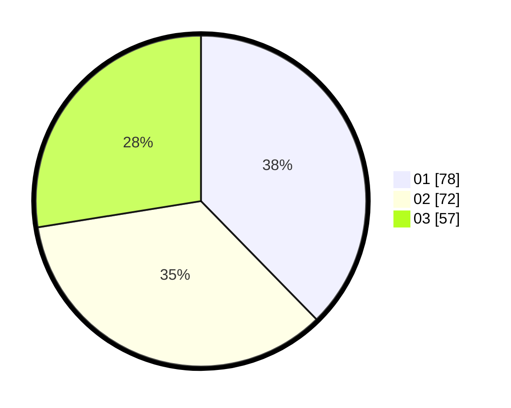

# Hasil

Hasil perolehan suara paslon dapat dilihat pada file paslon-01.txt, paslon-02.txt, dan paslon-03.txt.

Jika tidak ada, artinya data tersebut belum ada pada SIREKAP.

## Perolehan Suara

 * Paslon 01: **78**.
 * Paslon 02: **72**.
 * Paslon 03: **57**.

## Foto C Plano

https://sirekap-obj-formc.kpu.go.id/062e/pemilu/ppwp/31/75/01/10/04/3175011004001-20240214-213812--3463455f-7a87-408d-b9ce-b1ded30390e6.jpg

https://sirekap-obj-formc.kpu.go.id/062e/pemilu/ppwp/31/75/01/10/04/3175011004001-20240215-033437--d97512a5-3350-4e22-8518-e9036108f6fc.jpg

https://sirekap-obj-formc.kpu.go.id/062e/pemilu/ppwp/31/75/01/10/04/3175011004001-20240215-033541--618776c9-3d15-4c1e-b8ec-b343d6d8716c.jpg
