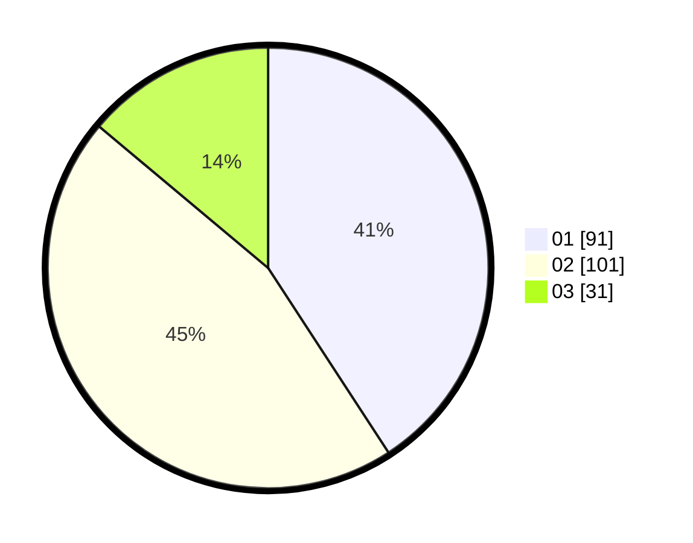

# Hasil

Hasil perolehan suara paslon dapat dilihat pada file paslon-01.txt, paslon-02.txt, dan paslon-03.txt.

Jika tidak ada, artinya data tersebut belum ada pada SIREKAP.

## Perolehan Suara

 * Paslon 01: **91**.
 * Paslon 02: **101**.
 * Paslon 03: **31**.

## Foto C Plano

https://sirekap-obj-formc.kpu.go.id/b4a6/pemilu/ppwp/31/75/01/10/04/3175011004004-20240214-190621--94f91644-c4d0-4066-a4dd-6e45a90c80e0.jpg

https://sirekap-obj-formc.kpu.go.id/b4a6/pemilu/ppwp/31/75/01/10/04/3175011004004-20240214-184833--36522b11-0448-4ab3-9e7d-478b2b2c2afc.jpg

https://sirekap-obj-formc.kpu.go.id/b4a6/pemilu/ppwp/31/75/01/10/04/3175011004004-20240214-185126--2bdcde28-5968-41d6-911e-e66cad031854.jpg

## DATA PEMILIH TETAP

Jumlah pemilih dalam DPT: **278**.
 * L: **137**.
 * P: **141**.

## DATA PENGGUNA HAK PILIH

Jumlah pengguna hak pilih dalam DPT: **216**.
 * L: **107**.
 * P: **109**.

Jumlah pengguna hak pilih dalam DPTb: **8**.
 * L: **5**.
 * P: **3**.

Jumlah pengguna hak pilih dalam DPK: **2**.
 * L: **0**.
 * P: **2**.

Jumlah pengguna hak pilih: **226**.
 * L: **112**.
 * P: **114**.

## JUMLAH SUARA SAH DAN TIDAK SAH

JUMLAH SELURUH SUARA SAH: **223**.

JUMLAH SUARA TIDAK SAH: **3**.

JUMLAH SELURUH SUARA SAH DAN SUARA TIDAK SAH: **226**.
