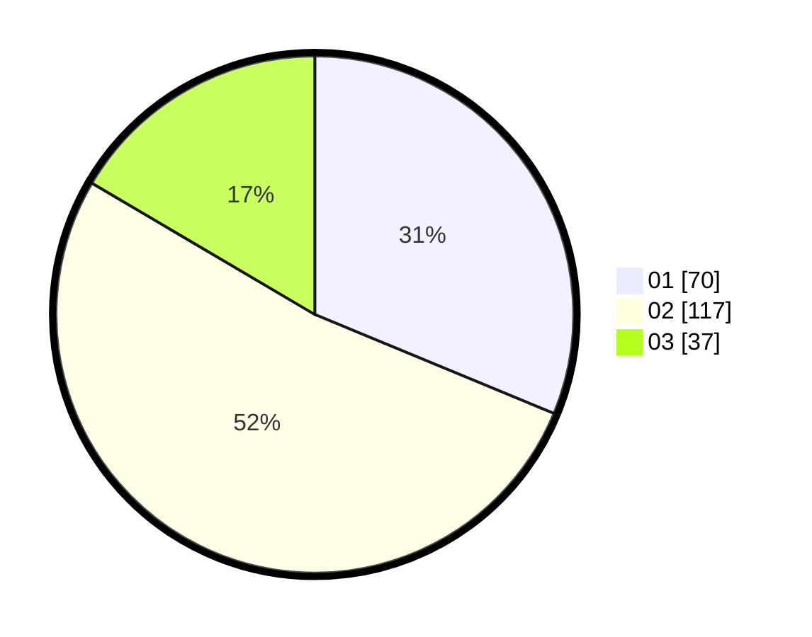

# Hasil

Hasil perolehan suara paslon dapat dilihat pada file paslon-01.txt, paslon-02.txt, dan paslon-03.txt.

Jika tidak ada, artinya data tersebut belum ada pada SIREKAP.

## Perolehan Suara

 * Paslon 01: **70**.
 * Paslon 02: **117**.
 * Paslon 03: **37**.

## Foto C Plano

https://sirekap-obj-formc.kpu.go.id/6273/pemilu/ppwp/31/75/01/10/04/3175011004006-20240215-013723--98246c93-4193-4fd6-b702-bb69692b07ae.jpg

https://sirekap-obj-formc.kpu.go.id/6273/pemilu/ppwp/31/75/01/10/04/3175011004006-20240215-014031--ba0fc03b-1336-4f75-a46f-fb342d6704ed.jpg

https://sirekap-obj-formc.kpu.go.id/6273/pemilu/ppwp/31/75/01/10/04/3175011004006-20240215-014325--bd1456cc-470f-4f9a-ba77-b1079f300651.jpg

## DATA PEMILIH TETAP

Jumlah pemilih dalam DPT: **288**.
 * L: **143**.
 * P: **145**.

## DATA PENGGUNA HAK PILIH

Jumlah pengguna hak pilih dalam DPT: **222**.
 * L: **105**.
 * P: **117**.

Jumlah pengguna hak pilih dalam DPTb: **5**.
 * L: **1**.
 * P: **4**.

Jumlah pengguna hak pilih dalam DPK: **1**.
 * L: **0**.
 * P: **1**.

Jumlah pengguna hak pilih: **228**.
 * L: **106**.
 * P: **122**.

## JUMLAH SUARA SAH DAN TIDAK SAH

JUMLAH SELURUH SUARA SAH: **224**.

JUMLAH SUARA TIDAK SAH: **4**.

JUMLAH SELURUH SUARA SAH DAN SUARA TIDAK SAH: **228**.
