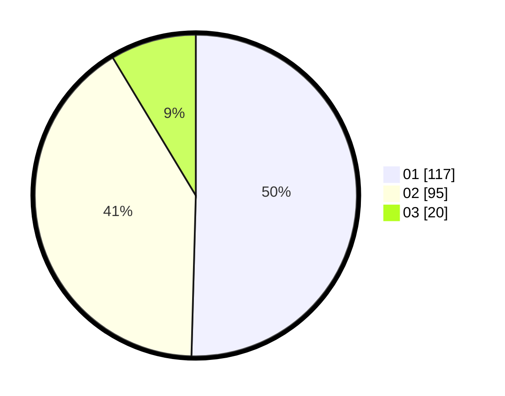

# Hasil

Hasil perolehan suara paslon dapat dilihat pada file paslon-01.txt, paslon-02.txt, dan paslon-03.txt.

Jika tidak ada, artinya data tersebut belum ada pada SIREKAP.

## Perolehan Suara

 * Paslon 01: **117**.
 * Paslon 02: **95**.
 * Paslon 03: **20**.

## Foto C Plano

https://sirekap-obj-formc.kpu.go.id/310f/pemilu/ppwp/31/75/01/10/04/3175011004007-20240214-193549--c50bc019-14f8-4a82-848d-4e408cb5ce5b.jpg

https://sirekap-obj-formc.kpu.go.id/310f/pemilu/ppwp/31/75/01/10/04/3175011004007-20240216-074739--37c0d561-3cbc-48fc-bf5c-7cb9a1948639.jpg

https://sirekap-obj-formc.kpu.go.id/310f/pemilu/ppwp/31/75/01/10/04/3175011004007-20240216-075821--220e34a1-1559-4146-a63f-4cee72141235.jpg

## DATA PEMILIH TETAP

Jumlah pemilih dalam DPT: **282**.
 * L: **139**.
 * P: **143**.

## DATA PENGGUNA HAK PILIH

Jumlah pengguna hak pilih dalam DPT: **229**.
 * L: **110**.
 * P: **119**.

Jumlah pengguna hak pilih dalam DPTb: **7**.
 * L: **1**.
 * P: **6**.

Jumlah pengguna hak pilih dalam DPK: **1**.
 * L: **1**.
 * P: **0**.

Jumlah pengguna hak pilih: **237**.
 * L: **112**.
 * P: **125**.

## JUMLAH SUARA SAH DAN TIDAK SAH

JUMLAH SELURUH SUARA SAH: **232**.

JUMLAH SUARA TIDAK SAH: **5**.

JUMLAH SELURUH SUARA SAH DAN SUARA TIDAK SAH: **5**.
