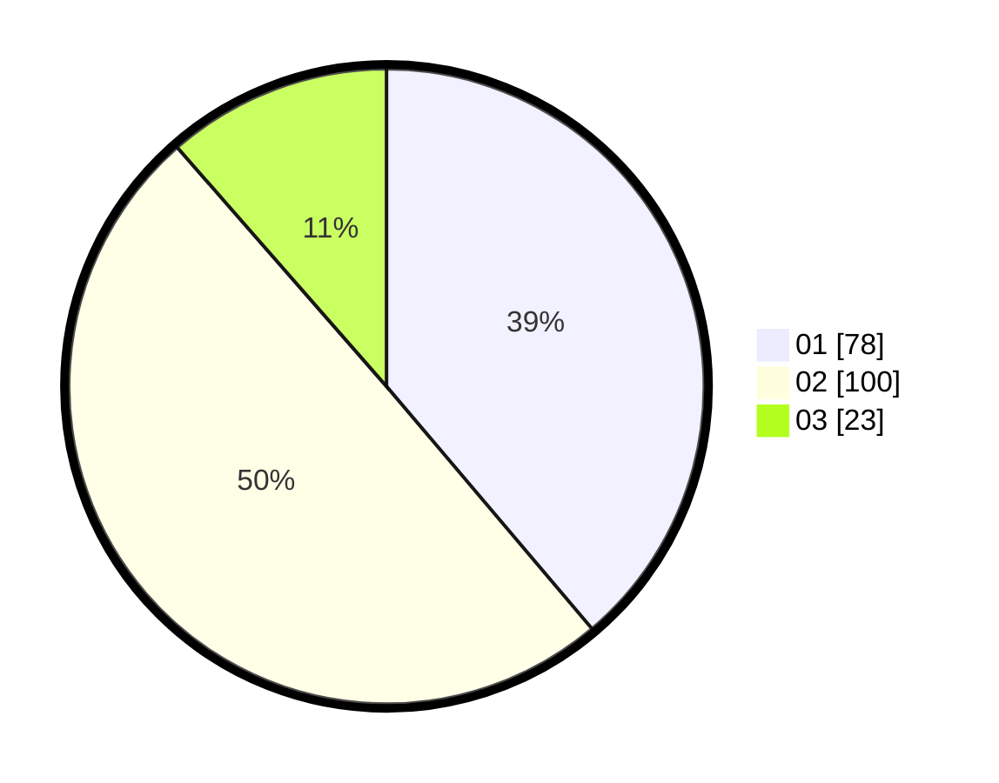

# Hasil

Hasil perolehan suara paslon dapat dilihat pada file paslon-01.txt, paslon-02.txt, dan paslon-03.txt.

Jika tidak ada, artinya data tersebut belum ada pada SIREKAP.

## Perolehan Suara

 * Paslon 01: **78**.
 * Paslon 02: **100**.
 * Paslon 03: **23**.

## Foto C Plano

https://sirekap-obj-formc.kpu.go.id/b568/pemilu/ppwp/31/75/01/10/04/3175011004017-20240214-162234--95eb2d70-906e-4cbe-b375-39fa2566a441.jpg

https://sirekap-obj-formc.kpu.go.id/b568/pemilu/ppwp/31/75/01/10/04/3175011004017-20240214-162228--be32b65f-15f2-4619-9e98-e9f586f2c910.jpg

https://sirekap-obj-formc.kpu.go.id/b568/pemilu/ppwp/31/75/01/10/04/3175011004017-20240216-095243--7c28ef6a-818e-460b-8921-cad2341bf6a9.jpg

## DATA PEMILIH TETAP

Jumlah pemilih dalam DPT: **267**.
 * L: **129**.
 * P: **138**.

## DATA PENGGUNA HAK PILIH

Jumlah pengguna hak pilih dalam DPT: **205**.
 * L: **96**.
 * P: **109**.

Jumlah pengguna hak pilih dalam DPTb: **0**.
 * L: **0**.
 * P: **0**.

Jumlah pengguna hak pilih dalam DPK: **0**.
 * L: **0**.
 * P: **0**.

Jumlah pengguna hak pilih: **205**.
 * L: **96**.
 * P: **109**.

## JUMLAH SUARA SAH DAN TIDAK SAH

JUMLAH SELURUH SUARA SAH: **201**.

JUMLAH SUARA TIDAK SAH: **4**.

JUMLAH SELURUH SUARA SAH DAN SUARA TIDAK SAH: **205**.
