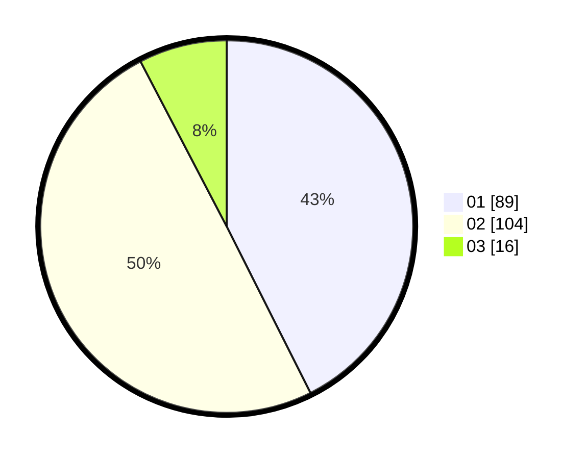

# Hasil

Hasil perolehan suara paslon dapat dilihat pada file paslon-01.txt, paslon-02.txt, dan paslon-03.txt.

Jika tidak ada, artinya data tersebut belum ada pada SIREKAP.

## Perolehan Suara

 * Paslon 01: **89**.
 * Paslon 02: **104**.
 * Paslon 03: **16**.

## Foto C Plano

https://sirekap-obj-formc.kpu.go.id/4fd2/pemilu/ppwp/31/75/01/10/04/3175011004026-20240215-004651--3871906d-8c76-4177-8a9d-49811f29f81a.jpg

https://sirekap-obj-formc.kpu.go.id/4fd2/pemilu/ppwp/31/75/01/10/04/3175011004026-20240214-205958--d265ff87-68c4-4d9e-a0b5-643005548ba4.jpg

https://sirekap-obj-formc.kpu.go.id/4fd2/pemilu/ppwp/31/75/01/10/04/3175011004026-20240214-210003--12323180-0f7a-4ea2-95d5-2d9cf8471245.jpg
