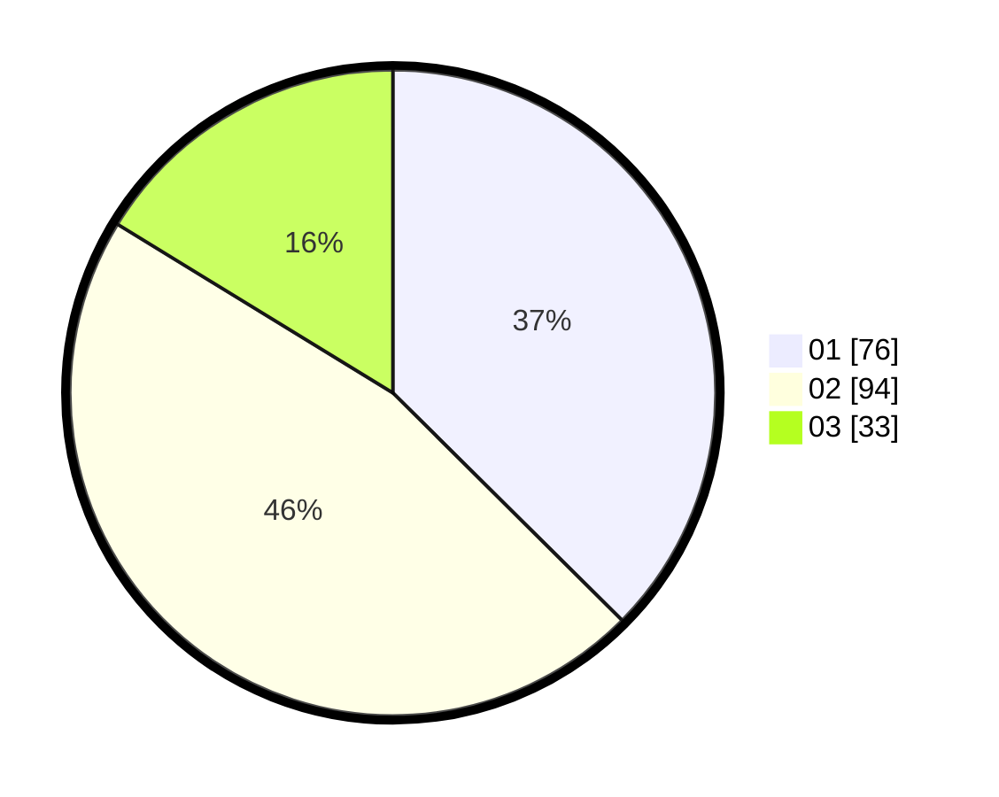

# Hasil

Hasil perolehan suara paslon dapat dilihat pada file paslon-01.txt, paslon-02.txt, dan paslon-03.txt.

Jika tidak ada, artinya data tersebut belum ada pada SIREKAP.

## Perolehan Suara

 * Paslon 01: **76**.
 * Paslon 02: **94**.
 * Paslon 03: **33**.

## Foto C Plano

https://sirekap-obj-formc.kpu.go.id/714a/pemilu/ppwp/31/75/01/10/04/3175011004028-20240215-010903--be909132-be19-4a28-8179-141ede0b102f.jpg

https://sirekap-obj-formc.kpu.go.id/714a/pemilu/ppwp/31/75/01/10/04/3175011004028-20240215-011043--c143b9f2-1b36-49dd-ab21-5fafe7c679c9.jpg

https://sirekap-obj-formc.kpu.go.id/714a/pemilu/ppwp/31/75/01/10/04/3175011004028-20240215-011320--2646afad-6a01-46ff-912b-f0d2e46ce64d.jpg

## DATA PEMILIH TETAP

Jumlah pemilih dalam DPT: **288**.
 * L: **145**.
 * P: **143**.

## DATA PENGGUNA HAK PILIH

Jumlah pengguna hak pilih dalam DPT: **209**.
 * L: **102**.
 * P: **107**.

Jumlah pengguna hak pilih dalam DPTb: **1**.
 * L: **1**.
 * P: **0**.

Jumlah pengguna hak pilih dalam DPK: **1**.
 * L: **1**.
 * P: **0**.

Jumlah pengguna hak pilih: **211**.
 * L: **104**.
 * P: **107**.

## JUMLAH SUARA SAH DAN TIDAK SAH

JUMLAH SELURUH SUARA SAH: **203**.

JUMLAH SUARA TIDAK SAH: **8**.

JUMLAH SELURUH SUARA SAH DAN SUARA TIDAK SAH: **211**.
