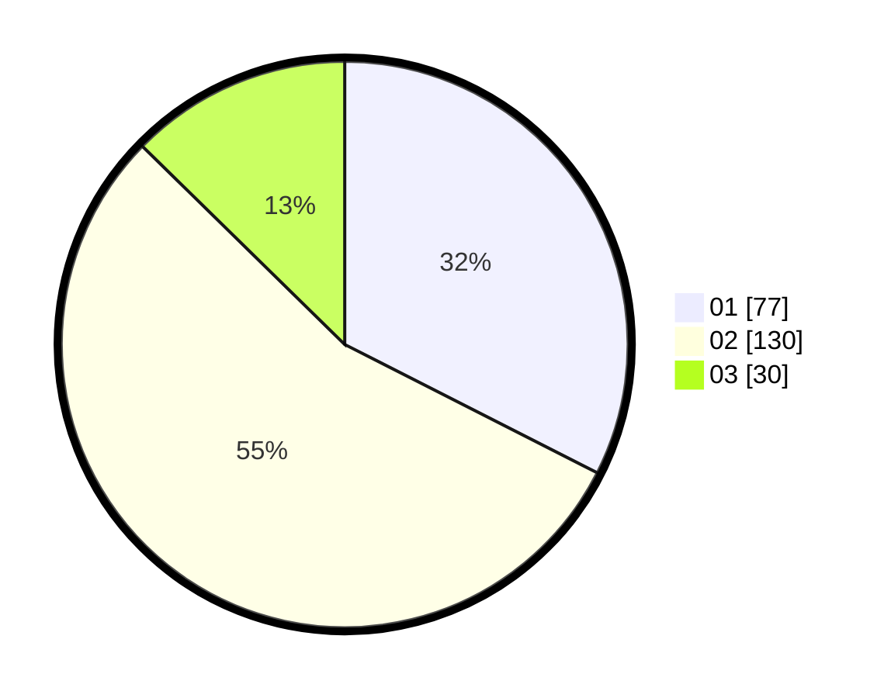

# Hasil

Hasil perolehan suara paslon dapat dilihat pada file paslon-01.txt, paslon-02.txt, dan paslon-03.txt.

Jika tidak ada, artinya data tersebut belum ada pada SIREKAP.

## Perolehan Suara

 * Paslon 01: **77**.
 * Paslon 02: **130**.
 * Paslon 03: **30**.

## Foto C Plano

https://sirekap-obj-formc.kpu.go.id/057e/pemilu/ppwp/31/75/01/10/04/3175011004032-20240215-061652--e8ce0c05-f140-4c22-9e84-b6776817ea61.jpg

https://sirekap-obj-formc.kpu.go.id/057e/pemilu/ppwp/31/75/01/10/04/3175011004032-20240215-062015--8d014ab1-6491-4bfd-8962-10dae641d700.jpg

https://sirekap-obj-formc.kpu.go.id/057e/pemilu/ppwp/31/75/01/10/04/3175011004032-20240215-062509--56ea042a-a924-42f9-b92e-9ca2c868e662.jpg
