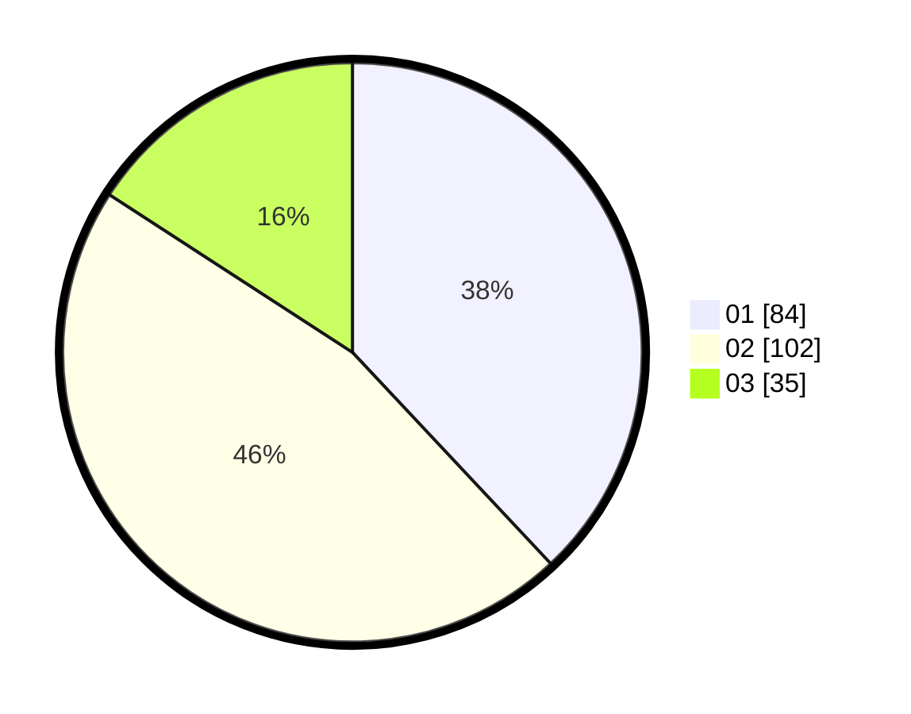

# Hasil

Hasil perolehan suara paslon dapat dilihat pada file paslon-01.txt, paslon-02.txt, dan paslon-03.txt.

Jika tidak ada, artinya data tersebut belum ada pada SIREKAP.

## Perolehan Suara

 * Paslon 01: **84**.
 * Paslon 02: **102**.
 * Paslon 03: **35**.

## Foto C Plano

https://sirekap-obj-formc.kpu.go.id/79f8/pemilu/ppwp/31/75/01/10/04/3175011004033-20240215-023255--96a4467f-9585-4045-bdf9-269ab2ec53fc.jpg

https://sirekap-obj-formc.kpu.go.id/79f8/pemilu/ppwp/31/75/01/10/04/3175011004033-20240215-023306--3a0a3d06-2eeb-4e4b-b725-8fccd7bfe7b3.jpg

https://sirekap-obj-formc.kpu.go.id/79f8/pemilu/ppwp/31/75/01/10/04/3175011004033-20240215-023315--ac332ab6-1058-4e97-a0f1-50ed48385588.jpg
