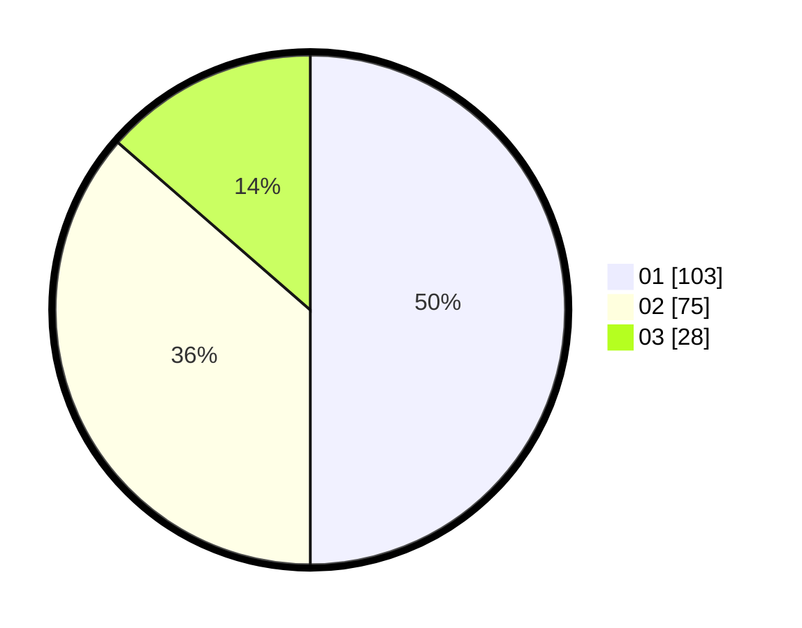

# Hasil

Hasil perolehan suara paslon dapat dilihat pada file paslon-01.txt, paslon-02.txt, dan paslon-03.txt.

Jika tidak ada, artinya data tersebut belum ada pada SIREKAP.

## Perolehan Suara

 * Paslon 01: **103**.
 * Paslon 02: **75**.
 * Paslon 03: **28**.

## Foto C Plano

https://sirekap-obj-formc.kpu.go.id/665f/pemilu/ppwp/31/75/01/10/04/3175011004036-20240215-041950--9f1d4ad2-316a-4e93-bc5e-a1672adb4e7c.jpg

https://sirekap-obj-formc.kpu.go.id/665f/pemilu/ppwp/31/75/01/10/04/3175011004036-20240215-042112--eef1a05e-27b7-4607-8aba-58deda60ded1.jpg

https://sirekap-obj-formc.kpu.go.id/665f/pemilu/ppwp/31/75/01/10/04/3175011004036-20240215-042247--7f1b42c3-0036-40a4-bfa7-a5d10ef1f4ba.jpg
