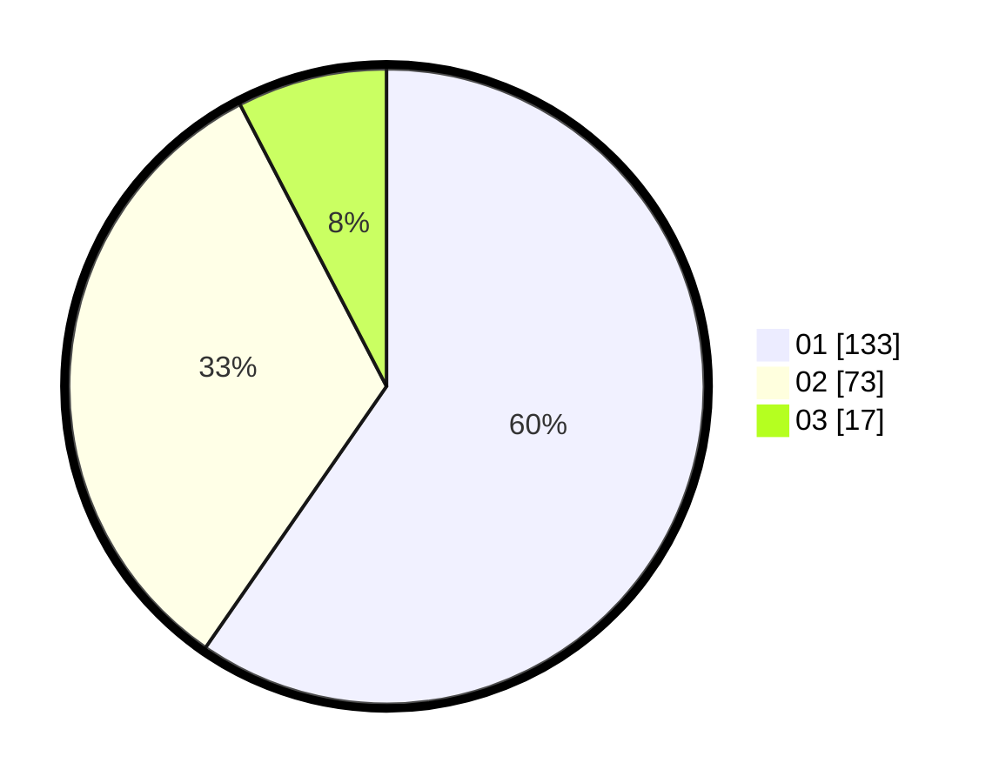

# Hasil

Hasil perolehan suara paslon dapat dilihat pada file paslon-01.txt, paslon-02.txt, dan paslon-03.txt.

Jika tidak ada, artinya data tersebut belum ada pada SIREKAP.

## Perolehan Suara

 * Paslon 01: **133**.
 * Paslon 02: **73**.
 * Paslon 03: **17**.

## Foto C Plano

https://sirekap-obj-formc.kpu.go.id/c62d/pemilu/ppwp/31/75/01/10/04/3175011004039-20240215-013202--dbbf1a29-f42f-46fa-ad6b-1a46d73d9301.jpg

https://sirekap-obj-formc.kpu.go.id/c62d/pemilu/ppwp/31/75/01/10/04/3175011004039-20240215-013243--1245cb8e-0142-4744-8d3d-b9b82a1eb6c6.jpg

https://sirekap-obj-formc.kpu.go.id/c62d/pemilu/ppwp/31/75/01/10/04/3175011004039-20240215-013317--3d7fa9ae-ed7e-4433-8986-62f2cc4f30d3.jpg

## DATA PEMILIH TETAP

Jumlah pemilih dalam DPT: **290**.
 * L: **150**.
 * P: **140**.

## DATA PENGGUNA HAK PILIH

Jumlah pengguna hak pilih dalam DPT: **222**.
 * L: **113**.
 * P: **109**.

Jumlah pengguna hak pilih dalam DPTb: **2**.
 * L: **1**.
 * P: **1**.

Jumlah pengguna hak pilih dalam DPK: **3**.
 * L: **0**.
 * P: **3**.

Jumlah pengguna hak pilih: **227**.
 * L: **114**.
 * P: **113**.

## JUMLAH SUARA SAH DAN TIDAK SAH

JUMLAH SELURUH SUARA SAH: **223**.

JUMLAH SUARA TIDAK SAH: **4**.

JUMLAH SELURUH SUARA SAH DAN SUARA TIDAK SAH: **227**.
