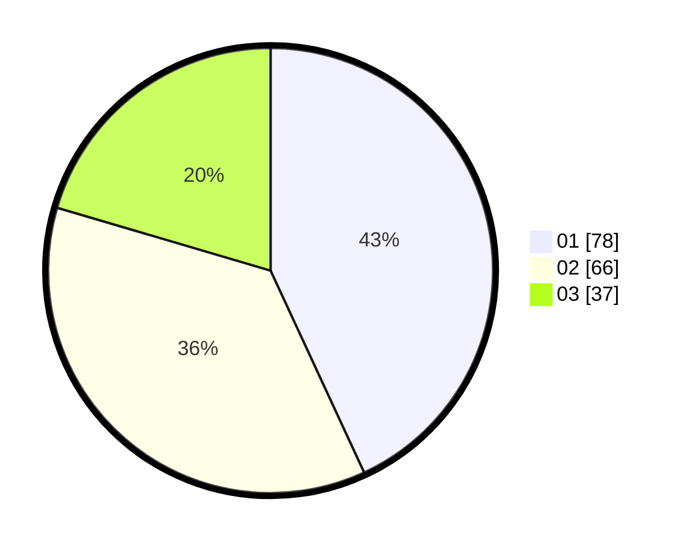

# Hasil

Hasil perolehan suara paslon dapat dilihat pada file paslon-01.txt, paslon-02.txt, dan paslon-03.txt.

Jika tidak ada, artinya data tersebut belum ada pada SIREKAP.

## Perolehan Suara

 * Paslon 01: **78**.
 * Paslon 02: **66**.
 * Paslon 03: **37**.

## Foto C Plano

https://sirekap-obj-formc.kpu.go.id/2add/pemilu/ppwp/31/75/01/10/04/3175011004043-20240214-214525--28dac179-b3d0-44cc-8b9b-1c115bcc6045.jpg

https://sirekap-obj-formc.kpu.go.id/2add/pemilu/ppwp/31/75/01/10/04/3175011004043-20240214-204534--d8233226-fd80-4ca4-9b38-e3c0436e18d4.jpg

https://sirekap-obj-formc.kpu.go.id/2add/pemilu/ppwp/31/75/01/10/04/3175011004043-20240214-204546--8bce246d-d90b-452f-913f-d57267f3f675.jpg
