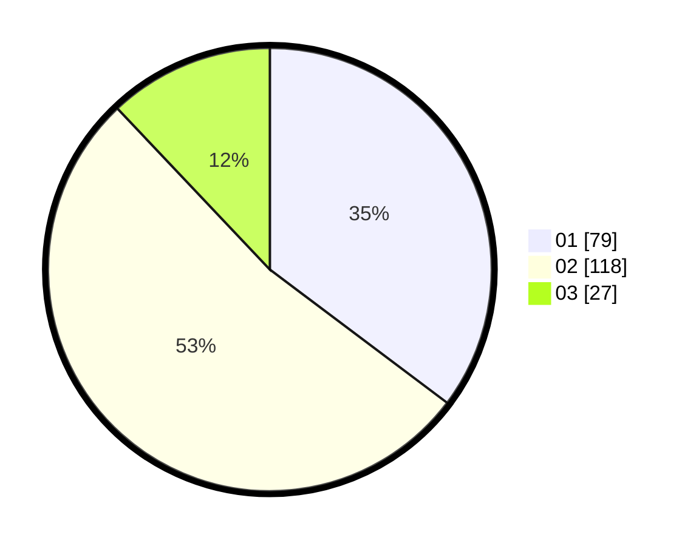

# Hasil

Hasil perolehan suara paslon dapat dilihat pada file paslon-01.txt, paslon-02.txt, dan paslon-03.txt.

Jika tidak ada, artinya data tersebut belum ada pada SIREKAP.

## Perolehan Suara

 * Paslon 01: **79**.
 * Paslon 02: **118**.
 * Paslon 03: **27**.

## Foto C Plano

https://sirekap-obj-formc.kpu.go.id/b96e/pemilu/ppwp/31/75/01/10/04/3175011004044-20240215-010301--d1238af6-5aca-44f2-94ad-1f4853b9ac40.jpg

https://sirekap-obj-formc.kpu.go.id/b96e/pemilu/ppwp/31/75/01/10/04/3175011004044-20240215-010509--3d316290-4a7a-4062-857e-24ff374accb0.jpg

https://sirekap-obj-formc.kpu.go.id/b96e/pemilu/ppwp/31/75/01/10/04/3175011004044-20240215-010558--b241b312-cb10-4773-8c18-e70ebc3d84f1.jpg

## DATA PEMILIH TETAP

Jumlah pemilih dalam DPT: **291**.
 * L: **157**.
 * P: **134**.

## DATA PENGGUNA HAK PILIH

Jumlah pengguna hak pilih dalam DPT: **291**.
 * L: **157**.
 * P: **134**.

Jumlah pengguna hak pilih dalam DPTb: **2**.
 * L: **1**.
 * P: **1**.

Jumlah pengguna hak pilih dalam DPK: **1**.
 * L: **1**.
 * P: **0**.

Jumlah pengguna hak pilih: **294**.
 * L: **158**.
 * P: **136**.

## JUMLAH SUARA SAH DAN TIDAK SAH

JUMLAH SELURUH SUARA SAH: **224**.

JUMLAH SUARA TIDAK SAH: **4**.

JUMLAH SELURUH SUARA SAH DAN SUARA TIDAK SAH: **228**.
