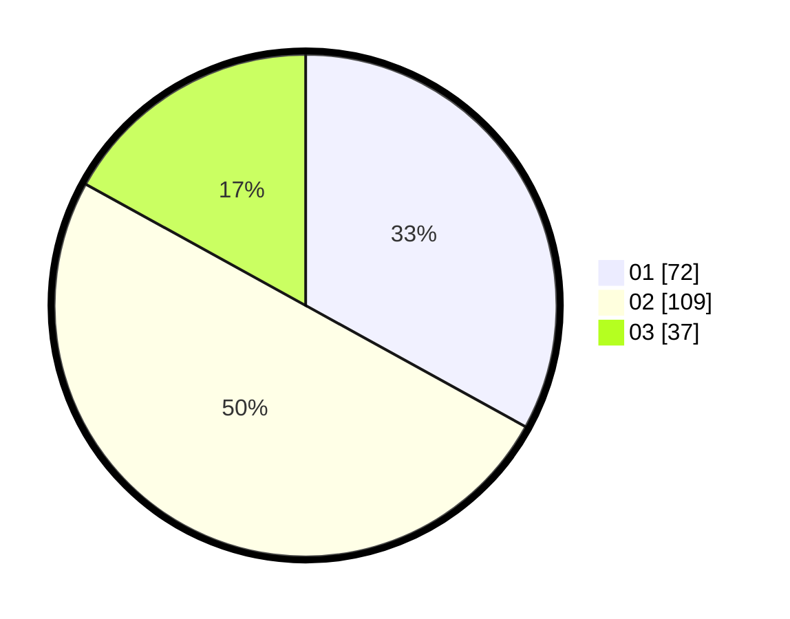

# Hasil

Hasil perolehan suara paslon dapat dilihat pada file paslon-01.txt, paslon-02.txt, dan paslon-03.txt.

Jika tidak ada, artinya data tersebut belum ada pada SIREKAP.

## Perolehan Suara

 * Paslon 01: **72**.
 * Paslon 02: **109**.
 * Paslon 03: **37**.

## Foto C Plano

https://sirekap-obj-formc.kpu.go.id/d0be/pemilu/ppwp/31/75/01/10/04/3175011004045-20240215-005514--9a782bff-6910-4a89-807a-baba28bcc469.jpg

https://sirekap-obj-formc.kpu.go.id/d0be/pemilu/ppwp/31/75/01/10/04/3175011004045-20240215-005635--f517c379-9a82-4391-a84f-34e5af3e2319.jpg
