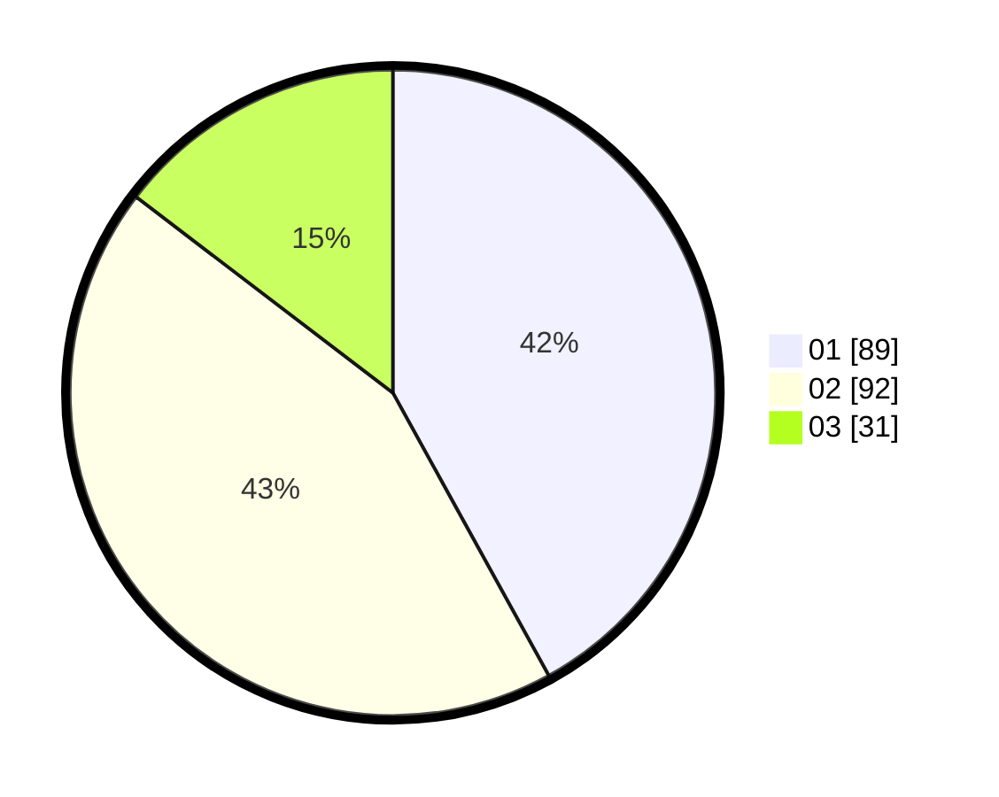

# Hasil

Hasil perolehan suara paslon dapat dilihat pada file paslon-01.txt, paslon-02.txt, dan paslon-03.txt.

Jika tidak ada, artinya data tersebut belum ada pada SIREKAP.

## Perolehan Suara

 * Paslon 01: **89**.
 * Paslon 02: **92**.
 * Paslon 03: **31**.

## Foto C Plano

https://sirekap-obj-formc.kpu.go.id/f2d3/pemilu/ppwp/31/75/01/10/04/3175011004046-20240214-184645--2ab41af6-0820-4797-a305-df99f72dc242.jpg

https://sirekap-obj-formc.kpu.go.id/f2d3/pemilu/ppwp/31/75/01/10/04/3175011004046-20240214-184554--fa062225-5f89-4e93-b42a-169f80e348ac.jpg

https://sirekap-obj-formc.kpu.go.id/f2d3/pemilu/ppwp/31/75/01/10/04/3175011004046-20240214-184608--0088e126-4f59-47e2-8b29-34b2a15d1d57.jpg

## DATA PEMILIH TETAP

Jumlah pemilih dalam DPT: **287**.
 * L: **138**.
 * P: **149**.

## DATA PENGGUNA HAK PILIH

Jumlah pengguna hak pilih dalam DPT: **207**.
 * L: **99**.
 * P: **108**.

Jumlah pengguna hak pilih dalam DPTb: **1**.
 * L: **1**.
 * P: **0**.

Jumlah pengguna hak pilih dalam DPK: **4**.
 * L: **1**.
 * P: **3**.

Jumlah pengguna hak pilih: **212**.
 * L: **101**.
 * P: **111**.

## JUMLAH SUARA SAH DAN TIDAK SAH

JUMLAH SELURUH SUARA SAH: **212**.

JUMLAH SUARA TIDAK SAH: **0**.

JUMLAH SELURUH SUARA SAH DAN SUARA TIDAK SAH: **212**.
