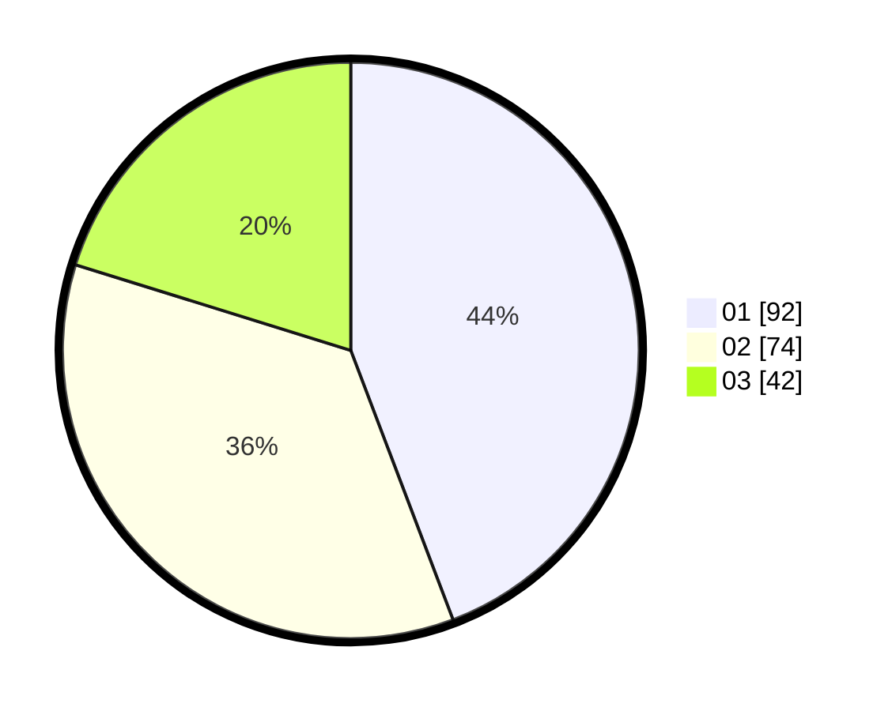

# Hasil

Hasil perolehan suara paslon dapat dilihat pada file paslon-01.txt, paslon-02.txt, dan paslon-03.txt.

Jika tidak ada, artinya data tersebut belum ada pada SIREKAP.

## Perolehan Suara

 * Paslon 01: **92**.
 * Paslon 02: **74**.
 * Paslon 03: **42**.

## Foto C Plano

https://sirekap-obj-formc.kpu.go.id/3eae/pemilu/ppwp/31/75/01/10/04/3175011004048-20240215-005431--372f165b-8439-4e38-926a-c967bd3516d5.jpg

https://sirekap-obj-formc.kpu.go.id/3eae/pemilu/ppwp/31/75/01/10/04/3175011004048-20240215-010211--eaebae7f-655d-4e0e-8c98-9fec6d7aefa0.jpg

https://sirekap-obj-formc.kpu.go.id/3eae/pemilu/ppwp/31/75/01/10/04/3175011004048-20240215-010419--f884763d-7748-4afc-bf71-48bd99e398f7.jpg
